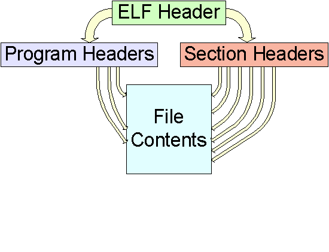

#ELF格式解析#

ELF作为Linux系统下的可执行文件与动态库的格式，一直没有完全明白，其中一个原因是ELF格式的很多教程参考ELF官方文档，讲解过程将目标文件(.o)和ELF文件格式混起来讲解，最终导致混乱，两个都没能清晰说明白。再者，很多教程也没有结合实例进行讲解，对`.o`，`a.out`和`.so`文件进行区分对比，导致很多概念混淆。

这一篇文章想从编译链接开始，首先总结编译中涉及到ELF格式的一些知识，然后将编译的结果`.o`文件进行分析说明；再总结链接中关于ELF格式的一些知识，最后将ELF文件和`.so`文件进行分析说明。希望最终通过这篇文章的总结，能够对编译链接过程有一个简单认识，更重要的是能够理解ELF文件的内容。

我们以如下的代码为例，对整篇文章中涉及的文件进行编译生成。

```
// hello.c
#include <stdio.h>
#include "output.h"

int global_init_var = 1;
int global_uninit_var;

int main()
{
	static int static_var = 3;
	static int static_var2;

	printf("Before call Func.\n");
	
	output("Hello World", global_init_var + static_var);

	static_var2 = 4;
	printf("After call Func. static_var2: %d\n", static_var2);

	return 0;
}

// output.h
#pragma once

int output(const char * str, int val);

// output.c
#include "output.h"
#include <stdio.h>

extern int global_uninit_var;

int output(const char * str, int val)
{
	if (0 == str)
	{
		return -1;
	}
	
	printf("%s: %s-%d", __func__, str, val);

	global_uninit_var = 2;
	printf("global_uninit_var: %d\n", global_uninit_var);

	return 0;
}
```

###可执行文件编译###

从源码到最终的可执行文件经过两个过程：编译和链接。这一节主要说编译中的一些知识总结。

编译过程又可以细分为预处理，编译，汇编三个子过程。预处理主要是将头文件，宏定义，条件编译等进行处理，将头文件爱包含到`.c`文件中，将宏定义进行替换等，可以使用`gcc -E hello.c -o hello.i`对C语言源代码进行预处理，预处理结果是一个可读的`.i`文本文件。编译主要是将预处理后的文件进行编译，生成汇编代码，可以使用`gcc -S hello.i -o hello.s`对预处理的文件进行编译，编译后的文件是`.s`汇编文件，它也是可读的文本文件。最后一步是汇编，即将汇编文件转换为二进制文件，即下一节中要分析的目标文件。汇编可以通过`gcc`进行，也可以使用汇编程序`as`来完成，`as hello.s -o hello.o`或`gcc -c hello.s -o hello.o`。

其实从上面的三个过程中可以看出，预处理就是对源代码的处理，它不会对编译生成的目标文件产生影响。对编译生成目标文件有影响的就是后面的两个过程，编译和汇编。

编译可以再次进行细分，即源码的词法分析，语法分析，语义分析，中间语言生成，目标代码生成。以中间语言为界限，编译器又被分为了编译前端和编译后端。编译前端完成中间语言生成，中间语言是与机器无关的跨平台代码；编译后端则将中间代码转换为目标机器代码，对于我们这里的例子来讲即生成i386兼容的汇编代码。

编译后端主要包括了代码生成器和目标代码优化器。代码生成器将中间代码转换为目标机器代码，这个过程直接依赖于目标机器，不同的机器有不同的字长，寄存器和整数类型。其实这块就和最终的目标文件有关系了，比如对于X86的平台，汇编中变量地址长度为4字节；而X64的平台上指针类型为8字节长。目标代码优化也和目标平台紧密相关，对最终生成的代码长度有直接影响。

用如下的命令，可以直接一步将代码编译为汇编代码。

```
$ gcc -S -m32 hello.c -o hello.s
$ gcc -S -m32 output.c -o output.s
```

其实到汇编代码这一级，生成了目标平台代码，我们已经能看到最终要放到目标文件中的一些数据了，如下为`hello.c`编译为汇编代码文件后的`hello.s`的内容。

```
	.file	"hello.c"
	.globl	global_init_var
	.data
	.align 4
	.type	global_init_var, @object
	.size	global_init_var, 4
global_init_var:
	.long	1
	.comm	global_uninit_var,4,4
	.section	.rodata
.LC0:
	.string	"Before call Func."
.LC1:
	.string	"Hello World"
	.align 4
.LC2:
	.string	"After call Func. static_var2: %d\n"
	.text
	.globl	main
	.type	main, @function
main:
.LFB0:
	.cfi_startproc
	leal	4(%esp), %ecx
	.cfi_def_cfa 1, 0
	andl	$-16, %esp
	pushl	-4(%ecx)
	pushl	%ebp
	.cfi_escape 0x10,0x5,0x2,0x75,0
	movl	%esp, %ebp
	pushl	%ecx
	.cfi_escape 0xf,0x3,0x75,0x7c,0x6
	subl	$4, %esp
	subl	$12, %esp
	pushl	$.LC0
	call	puts
	addl	$16, %esp
	movl	global_init_var, %edx
	movl	static_var.1938, %eax
	addl	%edx, %eax
	subl	$8, %esp
	pushl	%eax
	pushl	$.LC1
	call	output
	addl	$16, %esp
	movl	$4, static_var2.1939
	movl	static_var2.1939, %eax
	subl	$8, %esp
	pushl	%eax
	pushl	$.LC2
	call	printf
	addl	$16, %esp
	movl	$0, %eax
	movl	-4(%ebp), %ecx
	.cfi_def_cfa 1, 0
	leave
	.cfi_restore 5
	leal	-4(%ecx), %esp
	.cfi_def_cfa 4, 4
	ret
	.cfi_endproc
.LFE0:
	.size	main, .-main
	.data
	.align 4
	.type	static_var.1938, @object
	.size	static_var.1938, 4
static_var.1938:
	.long	3
	.local	static_var2.1939
	.comm	static_var2.1939,4,4
	.ident	"GCC: (Ubuntu 5.4.0-6ubuntu1~16.04.10) 5.4.0 20160609"
	.section	.note.GNU-stack,"",@progbits
```

可见此时对于函数和变量的引用都是使用符号，比如`main()`函数中调用`output()`函数，对其引用仍然是`call output`。

再经过汇编器完成代码的汇编之后，就变成了目标文件(`.o`)。目标文件中保存了二进制的代码，这块是下一节要分析的内容。使用如下命令，分别将两个`.s`文件汇编为对应的目标文件。

```
$ as --32 hello.s -o hello.o
$ as --32 output.s -o output.o
```

这里可能会有一个问题，既然代码最终要形成一个文件，为何要分开编译这么多`.o`呢？其实这是一个解决问题的思路，如果将所有代码放到一起，直接编译出一个可执行的文件，也不是不可以，但是存在问题是，如果项目足够大，单纯C代码就要几百兆，甚至是几个G，那么代码维护相当困难；其次，编译时因为他们在一个文件中，那么整个文件都要编译，编译时间与代价可想而知。之所以分割那么多`.c`，一方面是将问题分块，分而治之；另外一方面，在编译中如果只修改了部分代码，就可以单独只针对这块代码进行编译，其他已经编译好的`.o`文件可以直接参与链接，节省时间。

> 注： 编译程序，将整个编译过程打印出来可以使用这个命令，`gcc -v -m32 -g hello.c output.c`。X64系统上编译的X86的程序，所以要加入`-m32`。

###目标文件格式###

上一节中介绍到编译过程中生成的目标文件，我们这个例子中即`hello.o`和`output.o`。

编译器编译源代码后生成的文件叫做目标文件，它已经是二进制文件了，即"可执行文件"。由于它们没有经过链接，其中的跨模块的符号引用都是假设值，直接执行肯定会出现错误。尽管如此，目标文件本身其实就是按照可执行文件格式存储的，和真正可以执行的可执行文件在结构上略有差异。

PC上流行的可执行文件主要有Windows下的PE（Portable Executable）和Linux上的ELF（Executable Linkable Format），它们都是`COFF`的变种。目标文件就是源码编译后未链接的中间文件，即Windows上的`.obj`和Linux上的`.o`，上面说了它们和各自对应的可执行文件内容和结构很相似。Windows上统称`PE-COFF`文件格式，Linux上统称`ELF`。动态链接库也都按照可执行文件格式存储，即Windows上的`DLL(Dynamic Linking Library)`和Linux上的`SO`库。

目标文件中的内容其实从上面汇编中也大概可以看出来，包括指令，数据，除此之外还需要符号表，调试信息，字符串等链接中所需信息。目标文件将这些信息按照不同的属性进行分类，然后将它们存储到不同的节或段中。一个简单的目标文件格式(以ELF为例)如下：

|   ELF Header  |
|---------------|
| .text section |
| .data section |
| .bss section  |

ELF文件的开始处为`文件头`，它描述整个文件的文件属性，包括文件类型，是否可执行，静态链接还是动态链接，入口地址，目标硬件，目标操作系统等。此外它还应该包括一个段表，用于描述后面的各个`Section`，比如段的偏移，长度等。`.text`段则主要保存代码，`.data`段则保存有初始值的全局变量和局部静态变量等，`.bss`则用于保存未初始化的全局变量和局部静态变量。这是最简化的格式示意图，真正的结构要更复杂一些，下面就以`hello.o`为例逐块解析一下文件内容（32位平台上的文件为例）。

ELF格式最开始一部分是文件头，它的C语言格式结构体格式如下：

```
#define EI_NIDENT	16

typedef struct elf32_hdr{
  unsigned char	e_ident[EI_NIDENT];	// 如下结构体
  Elf32_Half	e_type;		// ELF文件类型
  Elf32_Half	e_machine;	// 1 为重定位，2为可执行文件，3为动态链接库，4为CoreDump等
  Elf32_Word	e_version;	// CPU类型，3为 EM_386，即IntelX86 CPU
  Elf32_Addr	e_entry;  	// 可执行程序入口点
  Elf32_Off	 e_phoff;		// 程序头偏移 Program headers
  Elf32_Off	 e_shoff;		// 节表头偏移 Section headers
  Elf32_Word	e_flags;	// ELF标志位，用来标识ELF平台相关属性
  Elf32_Half	e_ehsize;	// ELF文件头大小，例子为52字节
  Elf32_Half	e_phentsize;// 程序头大小
  Elf32_Half	e_phnum;	// 程序头的个数
  Elf32_Half	e_shentsize;// 节头大小
  Elf32_Half	e_shnum;	// 节头数量
  Elf32_Half	e_shstrndx;	// 段表字符串表所在段 在段表中的下标
} Elf32_Ehdr;

// IDENT部分也可以按照如下格式进行格式化，易于理解
typedef struct elf32_eIdent{
  unsigned char e_magic[4]; // 固定的 7F 45 4C 46，即7F-“ELF”
  unsigned char e_class;	// 文件类型，1 ELF32，2 ELF64
  unsigned char e_endian;	// 文件字节序，1 LSB，2 MSB
  unsigned char e_version;	// 版本号，目前必须设置为EV_CURRENT，即为1
  unsigned char e_osapi;	// 默认为0，即UNIX-System V
  unsigned char e_pad[8];	// 未使用字节，设置为0
}Elf32_EIndet;
```

用`readelf -h`将`hello.o`的ELF头读取出来如下：

```
$ readelf -h hello.o
ELF 头：
  Magic：   7f 45 4c 46 01 01 01 00 00 00 00 00 00 00 00 00
  类别:                              ELF32
  数据:                              2 补码，小端序 (little endian)
  版本:                              1 (current)
  OS/ABI:                            UNIX - System V
  ABI 版本:                          0

  类型:                              REL (可重定位文件)
  系统架构:                          Intel 80386
  版本:                              0x1
  入口点地址：                       0x0
  程序头起点：                       0 (bytes into file)
  Start of section headers:          912 (bytes into file)
  标志：             				0x0
  本头的大小：                       52 (字节)
  程序头大小：                       0 (字节)
  Number of program headers:         0
  节头大小：         			    40 (字节)
  节头数量：                         13
  字符串表索引节头： 10
```

按照`Elf32_Ehdr`结构体内容可以进行简单的对照查看。

```
$ hexdump -C -n 52 hello.o
00000000  7f 45 4c 46 01 01 01 00  00 00 00 00 00 00 00 00  |.ELF............|
00000010  01 00 03 00 01 00 00 00  00 00 00 00 00 00 00 00  |................|
00000020  90 03 00 00 00 00 00 00  34 00 00 00 00 00 28 00  |........4.....(.|
00000030  0d 00 0a 00                                       |....|
```

从上面的十六进制可以看出，在第十七个字节开始处，即`e_type`字段的值为`0x0001`，即表示重定位文件类型；同样在第31个字节处为字段`e_shoff`开始字节，表示节头从文件的`0x00000390`字节开始，与上面通过`readelf`获得的结果一样。其他的内容可以参考`elf.h`头文件中定义的各字段的值进行对比查看。

这里要说的是对于重定位文件来说，即这里的目标文件`.o`，它们并不是用来执行的，所以头中的程序头偏移值以及程序头大小，程序头的个数等字段均为0。其实这里就引出了ELF格式的两个视图的概念，即链接视图和执行视图。由于目标文件（`.o`）其实仅用于程序构建中的链接，不会进入内存执行，所以它不会存在执行视图中的内容。但是这里要注意一个问题，对于可执行的程序来说，它里面是包含两个视图的，它的链接视图当然不是为了链接（动态链接库用于链接除外），它是为了进行重定位等操作。所以对于目标文件来说，这里只需要对其链接视图进行分析即可（执行试图在后面分析可执行文件时会进行分析）。

在链接视图中，除了ELF头之外，文件剩余部分都是由节头表（多个节头组成的一块内容）的内容进行安排。下面先看一下打印出来各个节头。

```
$ readelf -S hello.o
共有 13 个节头，从偏移量 0x390 开始：

节头：
  [Nr] Name              Type            Addr     Off    Size   ES Flg Lk Inf Al
  [ 0]                   NULL            00000000 000000 000000 00      0   0  0
  [ 1] .text             PROGBITS        00000000 000034 00006c 00  AX  0   0  1
  [ 2] .rel.text         REL             00000000 0002d8 000050 08   I 11   1  4
  [ 3] .data             PROGBITS        00000000 0000a0 000008 00  WA  0   0  4
  [ 4] .bss              NOBITS          00000000 0000a8 000004 00  WA  0   0  4
  [ 5] .rodata           PROGBITS        00000000 0000a8 000042 00   A  0   0  4
  [ 6] .comment          PROGBITS        00000000 0000ea 000036 01  MS  0   0  1
  [ 7] .note.GNU-stack   PROGBITS        00000000 000120 000000 00      0   0  1
  [ 8] .eh_frame         PROGBITS        00000000 000120 000044 00   A  0   0  4
  [ 9] .rel.eh_frame     REL             00000000 000328 000008 08   I 11   8  4
  [10] .shstrtab         STRTAB          00000000 000330 00005f 00      0   0  1
  [11] .symtab           SYMTAB          00000000 000164 000110 10     12  11  4
  [12] .strtab           STRTAB          00000000 000274 000064 00      0   0  1
Key to Flags:
  W (write), A (alloc), X (execute), M (merge), S (strings)
  I (info), L (link order), G (group), T (TLS), E (exclude), x (unknown)
  O (extra OS processing required) o (OS specific), p (processor specific)
```

节头从上面的ELF头中可以发现，节头从文件第912字节偏移处开始，一共十三个节头，每个节头40个字节。上面给出了易读的节表。如下为节头的C语言结构体形式：

```
typedef struct elf32_shdr {
  Elf32_Word	sh_name;    // 节名字在字符串表中索引值，`.shstrtab`的字符串表
  Elf32_Word	sh_type;    // 节类型，比如符号节，重定位节，字符表节，动态链接符号表等
  Elf32_Word	sh_flags;   // 节的标记值，进程空间中属性，可写，分配空间，可执行等
  Elf32_Addr	sh_addr;    // 节虚拟地址，如果节被加载，表示内存中虚拟地址，否则为0
  Elf32_Off     sh_offset;  // 节在文件中的偏移
  Elf32_Word	sh_size;    // 节内容的长度
  Elf32_Word	sh_link;    // 节链接信息，即对应符号和
  Elf32_Word	sh_info;	//
  Elf32_Word	sh_addralign;// 节地址对齐，单位为`2^sh_addralign`字节
  Elf32_Word	sh_entsize; // 包含固定大小项的节，比如符号表，表示一项的大小
} Elf32_Shdr;
```

如下列举部分系统保留段，及其它们的属性。

| Name | sh_type | sh_flag|
|------|---------|--------|
|.bss  |SHT_NOBITS| SHF_ALLOC + SHF_WRITE |
|.commont  |SHT_PROGBITS | none |
|.data  |SHT_PROGBITS | SHF_ALLOC + SHF_WRITE |
|.data1  |SHT_PROGBITS| SHF_ALLOC + SHF_WRITE |
|.debug  |SHT_PROGBITS| none |
|.dynamic|SHT_DYNAMIC| SHF_ALLOC + SHF_WRITE |
|.hash  |SHT_HASH | SHF_ALLOC |
|.line  |SHT_PROGBITS| none |
|.note  |SHT_NOTE | none |
|.rodata |SHT_PROGBITS | SHF_ALLOC |
|.rodata1|SHT_PROGBITS | SHF_ALLOC |
|.shstrtab|SHT_STRTAB| none |
|.strtab  |SHT_STRTAB| SHF_ALLOC |
|.symtab  |SHT_SYMTAB| 同字符串表 |
|.text  |SHT_PROGBITS| SHF_ALLOC + SHF_WRITE |

其中节的链接信息（`sh_link`和`sh_info`）与节类型相关，只有链接相关的节，两个字段才有意义。

| sh_type | sh_link |      sh_info      |
|---------|---------|-------------------|
|SHT_DYNAMIC| 该段所使用的字符串表在节表中下标| 0 |
|SHT_HASH | 该段所使用的符号表在节表中下标| 0 |
|SHT_REL | 该段所使用相应符号表在节表中下标|该重定位表所作用的节在节表中下标|
|SHT_RELA | 该段所使用相应符号表在节表中下标|该重定位表所作用的节在节表中下标|
|SHT_SYMTAB | 操作系统相关的 | 操作系统相关的 |
|SHT_DYNSYM | 操作系统相关的 | 操作系统相关的 |
|other | SHN_UNDEF | 0|

所有节头的十六进制数据如下所示，第一个节头为空，后面节头每四十字节为一组，与C语言结构体可以对照查看。

```
00000390  00 00 00 00 00 00 00 00  00 00 00 00 00 00 00 00  |................|
000003b0  00 00 00 00 00 00 00 00  1f 00 00 00 01 00 00 00  |................|
000003c0  06 00 00 00 00 00 00 00  34 00 00 00 6c 00 00 00  |........4...l...|
000003d0  00 00 00 00 00 00 00 00  01 00 00 00 00 00 00 00  |................|
000003e0  1b 00 00 00 09 00 00 00  40 00 00 00 00 00 00 00  |........@.......|
000003f0  d8 02 00 00 50 00 00 00  0b 00 00 00 01 00 00 00  |....P...........|
00000400  04 00 00 00 08 00 00 00  25 00 00 00 01 00 00 00  |........%.......|
00000410  03 00 00 00 00 00 00 00  a0 00 00 00 08 00 00 00  |................|
00000420  00 00 00 00 00 00 00 00  04 00 00 00 00 00 00 00  |................|
00000430  2b 00 00 00 08 00 00 00  03 00 00 00 00 00 00 00  |+...............|
00000440  a8 00 00 00 04 00 00 00  00 00 00 00 00 00 00 00  |................|
00000450  04 00 00 00 00 00 00 00  30 00 00 00 01 00 00 00  |........0.......|
00000460  02 00 00 00 00 00 00 00  a8 00 00 00 42 00 00 00  |............B...|
00000470  00 00 00 00 00 00 00 00  04 00 00 00 00 00 00 00  |................|
00000480  38 00 00 00 01 00 00 00  30 00 00 00 00 00 00 00  |8.......0.......|
00000490  ea 00 00 00 36 00 00 00  00 00 00 00 00 00 00 00  |....6...........|
000004a0  01 00 00 00 01 00 00 00  41 00 00 00 01 00 00 00  |........A.......|
000004b0  00 00 00 00 00 00 00 00  20 01 00 00 00 00 00 00  |........ .......|
000004c0  00 00 00 00 00 00 00 00  01 00 00 00 00 00 00 00  |................|
000004d0  55 00 00 00 01 00 00 00  02 00 00 00 00 00 00 00  |U...............|
000004e0  20 01 00 00 44 00 00 00  00 00 00 00 00 00 00 00  | ...D...........|
000004f0  04 00 00 00 00 00 00 00  51 00 00 00 09 00 00 00  |........Q.......|
00000500  40 00 00 00 00 00 00 00  28 03 00 00 08 00 00 00  |@.......(.......|
00000510  0b 00 00 00 08 00 00 00  04 00 00 00 08 00 00 00  |................|
00000520  11 00 00 00 03 00 00 00  00 00 00 00 00 00 00 00  |................|
00000530  30 03 00 00 5f 00 00 00  00 00 00 00 00 00 00 00  |0..._...........|
00000540  01 00 00 00 00 00 00 00  01 00 00 00 02 00 00 00  |................|
00000550  00 00 00 00 00 00 00 00  64 01 00 00 10 01 00 00  |........d.......|
00000560  0c 00 00 00 0b 00 00 00  04 00 00 00 10 00 00 00  |................|
00000570  09 00 00 00 03 00 00 00  00 00 00 00 00 00 00 00  |................|
00000580  74 02 00 00 64 00 00 00  00 00 00 00 00 00 00 00  |t...d...........|
00000590  01 00 00 00 00 00 00 00                           |........|
```

从上面十六进制要完全对照出`readelf`的输出，目前还不太现实，还有一部分节没有解释它的内容，解释后就能完全解析出来。

根据上面各个节的偏移和大小，可以大致看出整个`hello.o`的组成。里面部分节的内容是叠加的，其实并非是这样，这里面`.bss`节本身在文件中是不占内容的，`.note.GNU-stack`在目标文件中也不占内容。

```
ELF Header         000000 000034
.text              000034 00006c
.data              0000a0 000008
//.bss             0000a8 000004
.rodata            0000a8 000042
.comment           0000ea 000036
//.note.GNU-stack  000120 000000
.eh_frame          000120 000044
.symtab            000164 000110
.strtab            000274 000064
.rel.text          0002d8 000050
.rel.eh_frame      000328 000008
.shstrtab          000330 00005f
.pad               00038f 000001
sec table          000390 000208
```

根据整个文件中各个节的顺序依次解析，在ELF头后就是代码节，使用`objdump -s`输出`hello.o`中的代码节内容。

```
$ objdump -d hello.o

hello.o：     文件格式 elf32-i386

Contents of section .text:
 0000 8d4c2404 83e4f0ff 71fc5589 e55183ec  .L$.....q.U..Q..
 0010 0483ec0c 68000000 00e8fcff ffff83c4  ....h...........
 0020 108b1500 000000a1 04000000 01d083ec  ................
 0030 08506812 000000e8 fcffffff 83c410c7  .Ph.............
 0040 05000000 00040000 00a10000 000083ec  ................
 0050 08506820 000000e8 fcffffff 83c410b8  .Ph ............
 0060 00000000 8b4dfcc9 8d61fcc3           .....M...a.. 

Disassembly of section .text:
00000000 <main>:
   0:	8d 4c 24 04          	lea    0x4(%esp),%ecx
   4:	83 e4 f0             	and    $0xfffffff0,%esp
   7:	ff 71 fc             	pushl  -0x4(%ecx)
   a:	55                   	push   %ebp
   b:	89 e5                	mov    %esp,%ebp
   d:	51                   	push   %ecx
   e:	83 ec 04             	sub    $0x4,%esp
  11:	83 ec 0c             	sub    $0xc,%esp
  14:	68 00 00 00 00       	push   $0x0
  19:	e8 fc ff ff ff       	call   1a <main+0x1a>
  1e:	83 c4 10             	add    $0x10,%esp
  21:	8b 15 00 00 00 00    	mov    0x0,%edx
  27:	a1 04 00 00 00       	mov    0x4,%eax
  2c:	01 d0                	add    %edx,%eax
  2e:	83 ec 08             	sub    $0x8,%esp
  31:	50                   	push   %eax
  32:	68 12 00 00 00       	push   $0x12
  37:	e8 fc ff ff ff       	call   38 <main+0x38>
  3c:	83 c4 10             	add    $0x10,%esp
  3f:	c7 05 00 00 00 00 04 	movl   $0x4,0x0
  46:	00 00 00 
  49:	a1 00 00 00 00       	mov    0x0,%eax
  4e:	83 ec 08             	sub    $0x8,%esp
  51:	50                   	push   %eax
  52:	68 20 00 00 00       	push   $0x20
  57:	e8 fc ff ff ff       	call   58 <main+0x58>
  5c:	83 c4 10             	add    $0x10,%esp
  5f:	b8 00 00 00 00       	mov    $0x0,%eax
  64:	8b 4d fc             	mov    -0x4(%ebp),%ecx
  67:	c9                   	leave
  68:	8d 61 fc             	lea    -0x4(%ecx),%esp
  6b:	c3                   	ret
```

从反汇编的代码中可以看到整个代码段的基地址为`0x00000000`，其中涉及的函数调用都用的相对地址，这个地址会在后面链接中进行重定位或重置，后面涉及到了再详细分析。代码节的十六进制内容长度为`0x6c`，反汇编长度也为`0x6c`，所以代码节没有其他的数据，全部是代码。

代码后为`.data`节，其中包含了初始化的全局变量和静态局部变量等。使用`objdump -s`打印出数据节的内容，如下所示。其中仅包含两个初始值为1和3的四字节长变量，它们其实就是源码中`int global_init_var = 1;`和`static int static_var = 3;`两个变量。

```
Contents of section .data:
 0000 01000000 03000000                    ........
```

`.bss`节在前面说过它是保存未初始化局部静态变量和未初始化全局变量用，它在文件中不占用空间。如果在可执行文件中，加载到内存时则必须为其分配指定长度的内存空间。

`.rodata`节为只读数据节，它主要包括字符串常量，全局const变量等。`.rodata1`和该节包含内容类似。如果在可执行文件中，它的内容加载到内存之后不可写与执行，只能读取。同样用`objdump -s`查看该节内容，如下代码段所示。可以看到其中包含了程序中的常量，本程序中主要是要打印的格式字符串。

```
Contents of section .rodata:
 0000 4265666f 72652063 616c6c20 46756e63  Before call Func
 0010 2e004865 6c6c6f20 576f726c 64000000  ..Hello World...
 0020 41667465 72206361 6c6c2046 756e632e  After call Func.
 0030 20737461 7469635f 76617232 3a202564   static_var2: %d
 0040 0a00                                 ..
```

`.comment`节为注释信息节，保存说明信息，主要是编译器的版本信息。比如如下`objdump -s hello.o`打印出来的该节内容。从内容可以看到，里面主要包含了该文件由那个系统上的什么版本编译器编译。

```
Contents of section .comment:
 0000 00474343 3a202855 62756e74 7520352e  .GCC: (Ubuntu 5.
 0010 342e302d 36756275 6e747531 7e31362e  4.0-6ubuntu1~16.
 0020 30342e31 30292035 2e342e30 20323031  04.10) 5.4.0 201
 0030 36303630 3900                        60609.
```

`.note.GNU-stack`节为堆栈提示节，它其实是一个空的节，不包含任何数据，节数据长度为0。那么该节做什么用的呢？它只是一个提示信息，如果目标文件中存在该节，告诉连接器`ld`它不需要可执行的栈。当然，正常的模块都不需要可执行的栈存在，而对于栈溢出攻击很多时候都需要栈具有可执行属性。所以设置一个该节，告诉连接器它不需要可执行栈；同样使用在汇编代码时使用`--noexecstack`选项也可以达到同样目的。这个功能只在`GCC`中生效。

`.eh_frame`为异常处理相关的节，这个是一个比较大的话题，这里不展开。使用`readelf -Wwf`命令可以读取文件中该节内容，如下。它的内容由一个`CIE(Commmon Information Entry)`结构体和多个`FDE(Frame Description Entry)`组成。

```
$ readelf -Wwf hello.o
Contents of the .eh_frame section:

00000000 00000014 00000000 CIE
  Version:               1
  Augmentation:          "zR"
  Code alignment factor: 1
  Data alignment factor: -4
  Return address column: 8
  Augmentation data:     1b

  DW_CFA_def_cfa: r4 (esp) ofs 4
  DW_CFA_offset: r8 (eip) at cfa-4
  DW_CFA_nop
  DW_CFA_nop

00000018 00000028 0000001c FDE cie=00000000 pc=00000000..0000006c
  DW_CFA_advance_loc: 4 to 00000004
  DW_CFA_def_cfa: r1 (ecx) ofs 0
  DW_CFA_advance_loc: 7 to 0000000b
  DW_CFA_expression: r5 (ebp) (DW_OP_breg5 (ebp): 0)
  DW_CFA_advance_loc: 3 to 0000000e
  DW_CFA_def_cfa_expression (DW_OP_breg5 (ebp): -4; DW_OP_deref)
  DW_CFA_advance_loc1: 89 to 00000067
  DW_CFA_def_cfa: r1 (ecx) ofs 0
  DW_CFA_advance_loc: 1 to 00000068
  DW_CFA_restore: r5 (ebp)
  DW_CFA_advance_loc: 3 to 0000006b
  DW_CFA_def_cfa: r4 (esp) ofs 4
```

`.symtab`节为符号节，其中包含了程序的符号信息。它其中每一项都为一个固定结构，C结构体格式如下代码块。

```
typedef struct elf32_sym{
  Elf32_Word	st_name;    // 名字在字符串表索引
  Elf32_Addr	st_value;   // 符号对应的值，和符号有关，可能为绝对地址，也可能为地址值
  Elf32_Word	st_size;    // 符号大小
  unsigned char	st_info;    // 符号类型和绑定信息
  unsigned char	st_other;   // 保留值，未使用
  Elf32_Half	st_shndx;   // 符号所在节
} Elf32_Sym;
```

```
$ readelf -s hello.o

Symbol table '.symtab' contains 17 entries:
   Num:    Value  Size Type    Bind   Vis      Ndx Name
     0: 00000000     0 NOTYPE  LOCAL  DEFAULT  UND
     1: 00000000     0 FILE    LOCAL  DEFAULT  ABS hello.c
     2: 00000000     0 SECTION LOCAL  DEFAULT    1
     3: 00000000     0 SECTION LOCAL  DEFAULT    3
     4: 00000000     0 SECTION LOCAL  DEFAULT    4
     5: 00000000     0 SECTION LOCAL  DEFAULT    5
     6: 00000004     4 OBJECT  LOCAL  DEFAULT    3 static_var.1938
     7: 00000000     4 OBJECT  LOCAL  DEFAULT    4 static_var2.1939
     8: 00000000     0 SECTION LOCAL  DEFAULT    7
     9: 00000000     0 SECTION LOCAL  DEFAULT    8
    10: 00000000     0 SECTION LOCAL  DEFAULT    6
    11: 00000000     4 OBJECT  GLOBAL DEFAULT    3 global_init_var
    12: 00000004     4 OBJECT  GLOBAL DEFAULT  COM global_uninit_var
    13: 00000000   108 FUNC    GLOBAL DEFAULT    1 main
    14: 00000000     0 NOTYPE  GLOBAL DEFAULT  UND puts
    15: 00000000     0 NOTYPE  GLOBAL DEFAULT  UND output
    16: 00000000     0 NOTYPE  GLOBAL DEFAULT  UND printf
```

使用`hexdump`命令列举符号节的十六进制内容如下所示：

```
$ hexdump -C -s 356 -n 272 hello.o
00000164  00 00 00 00 00 00 00 00  00 00 00 00 00 00 00 00  |................|
00000174  01 00 00 00 00 00 00 00  00 00 00 00 04 00 f1 ff  |................|
00000184  00 00 00 00 00 00 00 00  00 00 00 00 03 00 01 00  |................|
00000194  00 00 00 00 00 00 00 00  00 00 00 00 03 00 03 00  |................|
000001a4  00 00 00 00 00 00 00 00  00 00 00 00 03 00 04 00  |................|
000001b4  00 00 00 00 00 00 00 00  00 00 00 00 03 00 05 00  |................|
000001c4  09 00 00 00 04 00 00 00  04 00 00 00 01 00 03 00  |................|
000001d4  19 00 00 00 00 00 00 00  04 00 00 00 01 00 04 00  |................|
000001e4  00 00 00 00 00 00 00 00  00 00 00 00 03 00 07 00  |................|
000001f4  00 00 00 00 00 00 00 00  00 00 00 00 03 00 08 00  |................|
00000204  00 00 00 00 00 00 00 00  00 00 00 00 03 00 06 00  |................|
00000214  2a 00 00 00 00 00 00 00  04 00 00 00 11 00 03 00  |*...............|
00000224  3a 00 00 00 04 00 00 00  04 00 00 00 11 00 f2 ff  |:...............|
00000234  4c 00 00 00 00 00 00 00  6c 00 00 00 12 00 01 00  |L.......l.......|
00000244  51 00 00 00 00 00 00 00  00 00 00 00 10 00 00 00  |Q...............|
00000254  56 00 00 00 00 00 00 00  00 00 00 00 10 00 00 00  |V...............|
00000264  5d 00 00 00 00 00 00 00  00 00 00 00 10 00 00 00  |]...............|
```

从上述列举出的内容可以看出，与节头表类似，第一项都为空。每一项为结构体`Elf32_Sym`，它的大小正好为16字节。将十六进制和结构体对照可以很容易找到各个成员的值。

`.strtab`为字符串表节，`.shstrtab`节与它格式相同，只是保存内容不同。`.shstrtab`中保存了节头中节名所用的字符串，而`.strtab`中包含了其他的字符串。如下列举出它们的内容。

```
$ hexdump -C -s 628 -n 100 hello.o
00000274  00 68 65 6c 6c 6f 2e 63  00 73 74 61 74 69 63 5f  |.hello.c.static_|
00000284  76 61 72 2e 31 39 33 38  00 73 74 61 74 69 63 5f  |var.1938.static_|
00000294  76 61 72 32 2e 31 39 33  39 00 67 6c 6f 62 61 6c  |var2.1939.global|
000002a4  5f 69 6e 69 74 5f 76 61  72 00 67 6c 6f 62 61 6c  |_init_var.global|
000002b4  5f 75 6e 69 6e 69 74 5f  76 61 72 00 6d 61 69 6e  |_uninit_var.main|
000002c4  00 70 75 74 73 00 6f 75  74 70 75 74 00 70 72 69  |.puts.output.pri|
000002d4  6e 74 66 00                                       |ntf.|

$ hexdump -C -s 816 -n 95 hello.o
00000330  00 2e 73 79 6d 74 61 62  00 2e 73 74 72 74 61 62  |..symtab..strtab|
00000340  00 2e 73 68 73 74 72 74  61 62 00 2e 72 65 6c 2e  |..shstrtab..rel.|
00000350  74 65 78 74 00 2e 64 61  74 61 00 2e 62 73 73 00  |text..data..bss.|
00000360  2e 72 6f 64 61 74 61 00  2e 63 6f 6d 6d 65 6e 74  |.rodata..comment|
00000370  00 2e 6e 6f 74 65 2e 47  4e 55 2d 73 74 61 63 6b  |..note.GNU-stack|
00000380  00 2e 72 65 6c 2e 65 68  5f 66 72 61 6d 65 00     |..rel.eh_frame.|
```

从上述打印出来的内容中可以发现，字符串表都是以0结尾的字符串的组合，而第一个字符串总为空串，即只有0结束符。从前面也看到很多`name`字段，它们的值数值类型，这个字段的值即字符串表的索引，即该名字为从索引处开始到当前字符串结束这段字符即为它所用的内容。比如符号表的第七项内容为`000001c4  09 00 00 00 04 00 00 00  04 00 00 00 01 00 03 00  |................|`，它的`st_name`字段即为值`0x00000009`，从上面`.strtab`中查看下标为9开始的字符串为`static_var.1938`，即上面输出符号列表中索引为6的那一项。

在ELF头中最后一个成员`e_shstrndx`，它为节头表所用的字符串表所在节在节头表中的索引值。查看前面ELF头内容以及节头表索引，可以发现该字段值为10，正好对应`.shstrtab`节。

`.rel.text`和`.rel.eh_frame`两个节名字类似，都以字符串`.rel`开始，说明它们都是重定位节，后面半部分名称表示它所作用的节，即`.rel.text`中记录了代码节中的重定位信息。重定位节内容也为固定项组成，每一项都符合如下的C结构。

```
typedef struct elf32_rel {
  Elf32_Addr	r_offset;	// 需要重定位点在节中偏移
  Elf32_Word	r_info;		// 重定位点类型和符号，低8位为入口类型，高24位为符号表下标
} Elf32_Rel;
```

```
$ readelf -r hello.o

重定位节 '.rel.text' 位于偏移量 0x2d8 含有 10 个条目：
 偏移量     信息    类型              符号值      符号名称
00000015  00000501 R_386_32          00000000   .rodata
0000001a  00000e02 R_386_PC32        00000000   puts
00000023  00000b01 R_386_32          00000000   global_init_var
00000028  00000301 R_386_32          00000000   .data
00000033  00000501 R_386_32          00000000   .rodata
00000038  00000f02 R_386_PC32        00000000   output
00000041  00000401 R_386_32          00000000   .bss
0000004a  00000401 R_386_32          00000000   .bss
00000053  00000501 R_386_32          00000000   .rodata
00000058  00001002 R_386_PC32        00000000   printf

重定位节 '.rel.eh_frame' 位于偏移量 0x328 含有 1 个条目：
 偏移量     信息    类型              符号值      符号名称
00000020  00000202 R_386_PC32        00000000   .text
```

对于这种重定位，在32位x86平台上有两种指令寻址需要进行修改：绝对近址32位寻址和相对近址32位寻址。重定位类型也是两种`R_386_32（1）`和`R_386_PC32（2）`分别对应`绝对寻址修正 S+A`和`相对寻址修正 S+A-P`，其中A为保存在待修正位置的值，P为被修正的位置（相对于节开始的偏移或者虚拟地址，可以通过`r_offset`字段计算得到），S为符号的实际地址，即`r_info`的高24位指定的符号的实际地址。

比如以`hello.c`中的`global_init_var + static_var`两个变量重定位为例，其实它俩在编译后被分配到了`.data`节中，在`hello.o`中对于两个变量的访问如下汇编代码。

```
  21:	8b 15 00 00 00 00    	mov    0x0,%edx
  27:	a1 04 00 00 00       	mov    0x4,%eax
  2c:	01 d0                	add    %edx,%eax
```

即目标文件中无法确定变量的最终地址，这里使用值进行代替，`global_init_var`对应上面`8b 15`后的`00000000`值，而`static_var`则对应下面`a1`后的`00000004`。从上面重定位表中可以发现，`0x23`偏移处对应的信息为`00000b01`，即`R_386_32`类型重定位，对应的符号在符号表中索引为`0x0b`，查看前面打印符号表可知它对应的为`global_init_var`，而这个变量所在的节的索引为3，同理参考前面节表可以确定为`.data`节。那么最终重定位时，值为`.data节在可执行文件中的地址 + 0(A)`，其实就是`.data`节的第一个四字节，值为1；同理可以确定`static_var`在`.data`节的第二个四字节数据上。对应前面打印的`.data`节的数据，正好与此处对应。

```
$ hexdump -C -s 728 -n 80 hello.o
000002d8  15 00 00 00 01 05 00 00  1a 00 00 00 02 0e 00 00  |................|
000002e8  23 00 00 00 01 0b 00 00  28 00 00 00 01 03 00 00  |#.......(.......|
000002f8  33 00 00 00 01 05 00 00  38 00 00 00 02 0f 00 00  |3.......8.......|
00000308  41 00 00 00 01 04 00 00  4a 00 00 00 01 04 00 00  |A.......J.......|
00000318  53 00 00 00 01 05 00 00  58 00 00 00 02 10 00 00  |S.......X.......|
```

其实还有另外一种重定位表格式，如下为表项的C语言格式，它多了一个明确的加数，即`r_addend`。在计算重定位地址时需要额外加上这个值。

```
typedef struct elf32_rela{
  Elf32_Addr	r_offset;
  Elf32_Word	r_info;
  Elf32_Sword	r_addend;
} Elf32_Rela;
```

还有一部分重要内容是`.debug*`节，它们是保存调试信息的节，这里编译时并未加入调试信息，因此编译出来的目标目标文件中并没有包含这些节。这块内容也相对复杂，以后有机会单独总结一篇。

###目标文件的链接###

链接就是将目标文件（`.o`）拼接成可执行文件，或者动态链接库。链接的主要内容是把各个模块之间相互引用的部分都处理好，使得各个模块可以正确衔接。

从原理上来讲，链接器就是把一些指令对其它符号地址的引用加以修正，可以正确引用。链接过程主要包括地址和空间分配，符号决议和重定位等步骤。

以我们的程序为例，`main()`函数中有调用`output()`函数，而在前面的内容中可以知道，编译过程中`hello.c`和`output.c`是分别单独编译为独立的模块。在编译过程中，`main()`函数并不知道`output()`函数的地址，所以编译器就将`output()`函数的地址搁置，等到最后链接时由连接器去将这些指令的目标地址修正。上一节中的汇编代码可以看到使用了如下这种相对地址来替代`output()`函数的最终地址。

```
37:	e8 fc ff ff ff       	call   38 <main+0x38>
```

链接的两个步骤，第一是进行空间和地址分配，即扫描所有输入的目标文件，获得它们各个节的长度，属性和位置，并将其中符号表中所有符号定义和符号引用收集起来。这时就大致可以确定各个目标文件的节在最终文件中的位置，各节的地址也就确定下来。第二步是进行符号解析与重定位，读取输入文件中节的数据，重定位信息，进行符号解析与重定位，调整代码中的地址等。

在前面的`hello.o`解析中，我们看到了符号表信息，以及文件中的重定位信息。前面以全局变量`global_init_var + static_var`举例，解析了如何进行符号解析与重定位。其实那里面有一个量是未定的，即符号所在节的基地址，这个地址在第一步时进行分配。

简单了解了链接过程，使用如下的命令可以将我们编译出来的两个目标文件链接为可执行文件。

```
ld -m32 -march=i686 -m elf_i386 \
	-dynamic-linker /lib/ld-linux.so.2 \
	-z relro \
	/usr/lib32/crt1.o \
	/usr/lib32/crti.o \
	/usr/lib/gcc/x86_64-linux-gnu/5/32/crtbegin.o \
	-L/usr/lib/gcc/x86_64-linux-gnu/5/32 \
	-L/usr/lib32 \
	-L. \
	./hello.o \
	./output.o \
	-lgcc -lgcc_s -lc \
	/usr/lib/gcc/x86_64-linux-gnu/5/32/crtend.o \
	/usr/lib32/crtn.o
```

这里需要说明一下，因为代码中用到了C运行时库，并且真正要链接为可执行文件也需要C运行时库支持。当然了不使用C运行时库也可以链接为最终的可执行文件，但是那样会比较麻烦，所以这里将需要链接的C运行时库的前端和后端补充代码直接加进来。

###可执行文件格式###

这一节分析一下可执行文件的文件内容。从前面可知，可执行文件分为两种视图，链接视图和执行视图。先从链接视图上进行解析，然后再将执行视图解析一下。

链接视图和执行视图是文件内部不同角度看文件，它们只是将文件划分结构不同，但是全部内容加起来是完全相同的。如下为`hello`的ELF头。

```
$ readelf -h hello
ELF 头：
  Magic：   7f 45 4c 46 01 01 01 00 00 00 00 00 00 00 00 00 
  类别:                              ELF32
  数据:                              2 补码，小端序 (little endian)
  版本:                              1 (current)
  OS/ABI:                            UNIX - System V
  ABI 版本:                          0
  类型:                              EXEC (可执行文件)
  系统架构:                          Intel 80386
  版本:                              0x1
  入口点地址：                       0x80483a0
  程序头起点：                       52 (bytes into file)
  Start of section headers:          6260 (bytes into file)
  标志：                             0x0
  本头的大小：                       52 (字节)
  程序头大小：                       32 (字节)
  Number of program headers:         8
  节头大小：                         40 (字节)
  节头数量：                         29
  字符串表索引节头：                 26
```

ELF头在目标文件和可执行文件中结构完全相同，不同的是内部的值。在前面目标文件中，程序头偏移，程序头大小以及程序头数量都为0，这里可以看到它们都有了对应的取值。

如下图给出了两种视图的一种示意，即同一个ELF头，然后两种视图各有自己的头表，一个是程序头表，一个是节区头表。



**链接视图**

链接视图其实是由节表进行组织。在前面介绍目标文件时对节表已经有了详细解析，这里列举出内容，然后对于不同点进行解释。

```
$ readelf -S hello
共有 29 个节头，从偏移量 0x1874 开始：

节头：
  [Nr] Name              Type            Addr     Off    Size   ES Flg Lk Inf Al
  [ 0]                   NULL            00000000 000000 000000 00      0   0  0
  [ 1] .interp           PROGBITS        08048134 000134 000013 00   A  0   0  1
  [ 2] .note.ABI-tag     NOTE            08048148 000148 000020 00   A  0   0  4
  [ 3] .hash             HASH            08048168 000168 000038 04   A  4   0  4
  [ 4] .dynsym           DYNSYM          080481a0 0001a0 000090 10   A  5   1  4
  [ 5] .dynstr           STRTAB          08048230 000230 0000a9 00   A  0   0  1
  [ 6] .gnu.version      VERSYM          080482da 0002da 000012 02   A  4   0  2
  [ 7] .gnu.version_r    VERNEED         080482ec 0002ec 000020 00   A  5   1  4
  [ 8] .rel.dyn          REL             0804830c 00030c 000008 08   A  4   0  4
  [ 9] .rel.plt          REL             08048314 000314 000018 08  AI  4  22  4
  [10] .init             PROGBITS        0804832c 00032c 000023 00  AX  0   0  4
  [11] .plt              PROGBITS        08048350 000350 000040 04  AX  0   0 16
  [12] .plt.got          PROGBITS        08048390 000390 000008 00  AX  0   0  8
  [13] .text             PROGBITS        080483a0 0003a0 000222 00  AX  0   0 16
  [14] .fini             PROGBITS        080485c4 0005c4 000014 00  AX  0   0  4
  [15] .rodata           PROGBITS        080485d8 0005d8 000077 00   A  0   0  4
  [16] .eh_frame         PROGBITS        08048650 000650 0000ec 00   A  0   0  4
  [17] .init_array       INIT_ARRAY      08049f00 000f00 000004 00  WA  0   0  4
  [18] .fini_array       FINI_ARRAY      08049f04 000f04 000004 00  WA  0   0  4
  [19] .jcr              PROGBITS        08049f08 000f08 000004 00  WA  0   0  4
  [20] .dynamic          DYNAMIC         08049f0c 000f0c 0000f0 08  WA  5   0  4
  [21] .got              PROGBITS        08049ffc 000ffc 000004 04  WA  0   0  4
  [22] .got.plt          PROGBITS        0804a000 001000 000018 04  WA  0   0  4
  [23] .data             PROGBITS        0804a018 001018 000010 00  WA  0   0  4
  [24] .bss              NOBITS          0804a028 001028 00000c 00  WA  0   0  4
  [25] .comment          PROGBITS        00000000 001028 000035 01  MS  0   0  1
  [26] .shstrtab         STRTAB          00000000 00178d 0000e5 00      0   0  1
  [27] .symtab           SYMTAB          00000000 001060 0004a0 10     28  48  4
  [28] .strtab           STRTAB          00000000 001500 00028d 00      0   0  1
Key to Flags:
  W (write), A (alloc), X (execute), M (merge), S (strings)
  I (info), L (link order), G (group), T (TLS), E (exclude), x (unknown)
  O (extra OS processing required) o (OS specific), p (processor specific)
```

从上面节表信息可以看到，一共有29个节，与ELF头中节数量字段对应；ELF头最后一个字段为节表名称的字符串表所在节的索引值，即26，从节表中可以看到索引26的节名字为`.shstrtab`，和目标文件中相同。

对节表中各个节按照地址顺序进行排序可以得到`hello`这个ELF文件的按节方式的组成如下：

|    ELF头   | 0x000000|
|------------|---------|
| 程序头表 | 0x000034|
| .interp | 0x000134 |
| .note.ABI-tag | 0x000148 |
| .hash | 0x000168 |
| .dynsym  | 0x0001a0 |
| .dynstr | 0x000230 |
| .gnu.version | 0x0002da |
| .gnu.version_r | 0x0002ec |
| .rel.dyn | 0x00030c |
| .rel.plt | 0x000314 |
| .init | 0x00032c |
| .plt | 0x000350 |
| .plt.got | 0x000390 |
| .text | 0x0003a0 |
| .fini | 0x0005c4 |
| .rodata | 0x0005d8 |
| .eh_frame | 0x000650 |
| XXXXX  | 0x00073c |
| .init_array | 0x000f00 |
| .fini_array | 0x000f04 |
| .jcr | 0x000f08 |
| .dynamic | 0x000f0c |
| .got | 0x000ffc |
| .got.plt | 0x001000 |
| .data | 0x001018 |
| .bss | 0x001028 |
| .comment | 0x001028 |
| .symtab | 0x001060 |
| .strtab | 0x001500 |
| .shstrtab | 0x00178d |
| 节头表 | 0x001874 |

程序头内容在后面分析执行视图时再介绍。

第一节为`.interp`，它是程序的加载器的全路径，就是一个文件路径，直接查看文件原始内容，如下代码块。可知我们程序的加载器为`/lib/ld-linux.so`。

```
$ hexdump -s 0x134 -n 32 -C hello
00000134  2f 6c 69 62 2f 6c 64 2d  6c 69 6e 75 78 2e 73 6f  |/lib/ld-linux.so|
00000144  2e 32 00 00 04 00 00 00  10 00 00 00 01 00 00 00  |.2..............|
```

第二个节区为`.note.ABI-tag`，它用于定义一个注释，用于标识该ELF针对什么操作系统ABI生成。

```
$ hexdump -s 0x148 -n 128 -C  hello
00000148  04 00 00 00 10 00 00 00  01 00 00 00 47 4e 55 00  |............GNU.|
00000158  00 00 00 00 02 00 00 00  06 00 00 00 20 00 00 00  |............ ...|
00000168  03 00 00 00 09 00 00 00  07 00 00 00 08 00 00 00  |................|
```

```
offset	length	contents
0	4	length of name
4	4	length of data
8	4	note type
12	(0)	vendor name - null-terminated ASCII string, padded to 4-byte alignment
12+(0)	(4)	note data,
16      4       desc type(0-Linux)
20      12      ABI-version(最早内核兼容版本)  此例子为2.6.32
```

第三个节为`.hash`，它保存了符号的哈希值，用于快速找到符号表中的符号条目。哈希表节按照如下的方式进行排列

|     nbucket     |
|-----------------|
|      nchain     |
|    bucket[0]    |
|   ......        |
|bucket[nbucket-1]|
|    chain[0]     |
|     ......      |
| chain[nchain-1] |

如下打印哈希表的十六进制内容如下：

```
$ hexdump -s 0x168 -n 56 -C  hello
00000168  03 00 00 00 09 00 00 00  07 00 00 00 08 00 00 00  |................|
00000178  05 00 00 00 00 00 00 00  00 00 00 00 00 00 00 00  |................|
00000188  01 00 00 00 00 00 00 00  02 00 00 00 03 00 00 00  |................|
00000198  04 00 00 00 06 00 00 00                           |........|
```

哈希表的使用中，将一个符号`symbol`传给哈希函数，计算出的值`x`，计算`y=x%nbucket`，然后以`bucket[y]`的值为索引查找符号表即为要找符号的条目。如果索引值所指的条目不是给定的`symbol`对应条目，那么使用`chain[bucket[u]]`给出下一个符号表索引，如果仍然不是则继续沿着`chain`数组依次查找，直到`STN_UNDEF`为止。

下面代码块给出哈希函数：

```
unsigned long
elf_Hash(const unsigned char *name)
{
    unsigned long h = 0, g;

    while (*name)
    {
         h = (h << 4) + *name++;
         if (g = h & 0xf0000000)
             h ^= g >> 24;
         h &= ~g;
    }
    return h;
}
```

第四个节为`.dynsym`，动态链接符号节，它的格式和`.symtab`相同，并且它所包含的符号在`.symtab`中都有包含，即相当于`.symtab`的一个子集。不同地方是这个节会被加载到内存，用于动态链接，而`.symtab`不会加载到内存，并且使用`strip`命令可以将`.symtab`节删除掉。

```
$ readelf -s hello

Symbol table '.dynsym' contains 9 entries:
   Num:    Value  Size Type    Bind   Vis      Ndx Name
     0: 00000000     0 NOTYPE  LOCAL  DEFAULT  UND
     1: 00000000     0 NOTYPE  WEAK   DEFAULT  UND _ITM_deregisterTMCloneTab
     2: 00000000     0 FUNC    GLOBAL DEFAULT  UND printf@GLIBC_2.0 (2)
     3: 00000000     0 FUNC    GLOBAL DEFAULT  UND puts@GLIBC_2.0 (2)
     4: 00000000     0 NOTYPE  WEAK   DEFAULT  UND __gmon_start__
     5: 080485dc     4 OBJECT  GLOBAL DEFAULT   15 _IO_stdin_used
     6: 00000000     0 FUNC    GLOBAL DEFAULT  UND __libc_start_main@GLIBC_2.0 (2)
     7: 00000000     0 NOTYPE  WEAK   DEFAULT  UND _Jv_RegisterClasses
     8: 00000000     0 NOTYPE  WEAK   DEFAULT  UND _ITM_registerTMCloneTable
```

十六进制的显示如下，可以从十六进制中看到它的第一项全为0，第二项的第一个字段为`0x0f`，即符号名在字符串表的索引。在下一个节的解析中就会发现它其实对应的就是上面看到的`_ITM_deregisterTMCloneTable`。

```
$ hexdump -s 0x1a0 -n 144 -C  hello
000001a0  00 00 00 00 00 00 00 00  00 00 00 00 00 00 00 00  |................|
000001b0  0f 00 00 00 00 00 00 00  00 00 00 00 20 00 00 00  |............ ...|
000001c0  86 00 00 00 00 00 00 00  00 00 00 00 12 00 00 00  |................|
000001d0  81 00 00 00 00 00 00 00  00 00 00 00 12 00 00 00  |................|
000001e0  2b 00 00 00 00 00 00 00  00 00 00 00 20 00 00 00  |+........... ...|
000001f0  72 00 00 00 dc 85 04 08  04 00 00 00 11 00 0f 00  |r...............|
00000200  8d 00 00 00 00 00 00 00  00 00 00 00 12 00 00 00  |................|
00000210  3a 00 00 00 00 00 00 00  00 00 00 00 20 00 00 00  |:........... ...|
00000220  4e 00 00 00 00 00 00 00  00 00 00 00 20 00 00 00  |N........... ...|
```

第五个节为`.dynstr`，它和`.strtab`的关系，如同上一个节`.dynsym`类似。它的格式不再详细说明，如下列举出它的十六进制内容。印证`.dynsyn`中第二项符号的名字在字符串的索引为`0x0f`，即`_ITM_deregisterTMCloneTable`。

```
$ hexdump -s 0x230 -n 169 -C  hello
00000230  00 6c 69 62 67 63 63 5f  73 2e 73 6f 2e 31 00 5f  |.libgcc_s.so.1._|
00000240  49 54 4d 5f 64 65 72 65  67 69 73 74 65 72 54 4d  |ITM_deregisterTM|
00000250  43 6c 6f 6e 65 54 61 62  6c 65 00 5f 5f 67 6d 6f  |CloneTable.__gmo|
00000260  6e 5f 73 74 61 72 74 5f  5f 00 5f 4a 76 5f 52 65  |n_start__._Jv_Re|
00000270  67 69 73 74 65 72 43 6c  61 73 73 65 73 00 5f 49  |gisterClasses._I|
00000280  54 4d 5f 72 65 67 69 73  74 65 72 54 4d 43 6c 6f  |TM_registerTMClo|
00000290  6e 65 54 61 62 6c 65 00  6c 69 62 63 2e 73 6f 2e  |neTable.libc.so.|
000002a0  36 00 5f 49 4f 5f 73 74  64 69 6e 5f 75 73 65 64  |6._IO_stdin_used|
000002b0  00 70 75 74 73 00 70 72  69 6e 74 66 00 5f 5f 6c  |.puts.printf.__l|
000002c0  69 62 63 5f 73 74 61 72  74 5f 6d 61 69 6e 00 47  |ibc_start_main.G|
000002d0  4c 49 42 43 5f 32 2e 30  00                       |LIBC_2.0.|
```

第六个节为`.gnu.version`，保存内容为符号版本表，该节区如何解析没有找到相关的资料。类似的节还有`.gnu.version_d`和`.gnu.version_r`，它们为版本定义(Version Definitions)和版本要求（Version Requirments）。`.gnu.version`和`.gnu.version_r`的十六进制内容如下所示：

```
$ hexdump -s 0x2da -n 50 -C  hello
000002da  00 00 00 00 02 00 02 00  00 00 01 00 02 00 00 00  |................|
000002ea  00 00 01 00 01 00 68 00  00 00 10 00 00 00 00 00  |......h.........|
000002fa  00 00 10 69 69 0d 00 00  02 00 9f 00 00 00 00 00  |...ii...........|
0000030a  00 00                                             |..|
```

接下来的两个节内容相同，只是作用的节区不同。以`.rel`开始的节名都是重定位节。打印两个节的内容如下：

```
$ readelf -r hello

重定位节 '.rel.dyn' 位于偏移量 0x30c 含有 1 个条目：
 偏移量     信息    类型              符号值      符号名称
08049ffc  00000406 R_386_GLOB_DAT    00000000   __gmon_start__

重定位节 '.rel.plt' 位于偏移量 0x314 含有 3 个条目：
 偏移量     信息    类型              符号值      符号名称
0804a00c  00000207 R_386_JUMP_SLOT   00000000   printf@GLIBC_2.0
0804a010  00000307 R_386_JUMP_SLOT   00000000   puts@GLIBC_2.0
0804a014  00000607 R_386_JUMP_SLOT   00000000   __libc_start_main@GLIBC_2.0
```

```
$ hexdump -s 0x30c -n 32 -C  hello
0000030c  fc 9f 04 08 06 04 00 00  0c a0 04 08 07 02 00 00  |................|
0000031c  10 a0 04 08 07 03 00 00  14 a0 04 08 07 06 00 00  |................|
```

重定位节的格式以及计算方法前面解析过，这里不再详细解释它的含义。

第十个节为`.init`，它和`.fini`节构成一对。`.init`中包含进程初始化代码，它在模块的入口函数之前执行；`.fini`节包含进程终止代码，如果进程正常结束（非意外终止），那么就会调用到该节的代码。这两个节里面一些编译器会安排全局对象的构造函数和析构函数。

```
Disassembly of section .init:

0804832c <_init>:
 804832c:	53                   	push   %ebx
 804832d:	83 ec 08             	sub    $0x8,%esp
 8048330:	e8 9b 00 00 00       	call   80483d0 <__x86.get_pc_thunk.bx>
 8048335:	81 c3 cb 1c 00 00    	add    $0x1ccb,%ebx
 804833b:	8b 83 fc ff ff ff    	mov    -0x4(%ebx),%eax
 8048341:	85 c0                	test   %eax,%eax
 8048343:	74 05                	je     804834a <_init+0x1e>
 8048345:	e8 46 00 00 00       	call   8048390 <__libc_start_main@plt+0x10>
 804834a:	83 c4 08             	add    $0x8,%esp
 804834d:	5b                   	pop    %ebx
 804834e:	c3                   	ret 

Disassembly of section .fini:

080485c4 <_fini>:
 80485c4:	53                   	push   %ebx
 80485c5:	83 ec 08             	sub    $0x8,%esp
 80485c8:	e8 03 fe ff ff       	call   80483d0 <__x86.get_pc_thunk.bx>
 80485cd:	81 c3 33 1a 00 00    	add    $0x1a33,%ebx
 80485d3:	83 c4 08             	add    $0x8,%esp
 80485d6:	5b                   	pop    %ebx
 80485d7:	c3                   	ret  
```

在这两个节中都是代码，这里不再过多解释。

再下面两个节为`.plt`和`.plt.got`，它们的节名为`.plt`开始，`plt`为`Procedure Linkage Table`（过程链接表），而`got`为`Global Offset Table`（全局偏移表），它们共同实现了动态链接的工作。`.plt*`的两个节中内容全部都是代码（可以从节表中该节大小与反汇编代码的起始结束地址做对比），代码如下：

```
Disassembly of section .plt:

08048350 <printf@plt-0x10>:
 8048350:	ff 35 04 a0 04 08    	pushl  0x804a004
 8048356:	ff 25 08 a0 04 08    	jmp    *0x804a008
 804835c:	00 00                	add    %al,(%eax)
 804835e:	00 00                	add    %al,(%eax)

08048360 <printf@plt>:
 8048360:	ff 25 0c a0 04 08    	jmp    *0x804a00c
 8048366:	68 00 00 00 00       	push   $0x0
 804836b:	e9 e0 ff ff ff       	jmp    8048350 <_init+0x24>

08048370 <puts@plt>:
 8048370:	ff 25 10 a0 04 08    	jmp    *0x804a010
 8048376:	68 08 00 00 00       	push   $0x8
 804837b:	e9 d0 ff ff ff       	jmp    8048350 <_init+0x24>

08048380 <__libc_start_main@plt>:
 8048380:	ff 25 14 a0 04 08    	jmp    *0x804a014
 8048386:	68 10 00 00 00       	push   $0x10
 804838b:	e9 c0 ff ff ff       	jmp    8048350 <_init+0x24>

Disassembly of section .plt.got:

08048390 <.plt.got>:
 8048390:	ff 25 fc 9f 04 08    	jmp    *0x8049ffc
 8048396:	66 90                	xchg   %ax,%ax
```

这块内容先不解释，后面解释可执行文件的动态链接时再一起解释。

`.text`节的内容就全部是代码了，它包含了所有编译出来的目标文件`.o`，以及链接进来的C运行时库的代码。反汇编代码如下代码段所示：

```
Disassembly of section .text:

080483a0 <_start>:
 80483a0:	31 ed                	xor    %ebp,%ebp
 80483a2:	5e                   	pop    %esi
 80483a3:	89 e1                	mov    %esp,%ecx
 80483a5:	83 e4 f0             	and    $0xfffffff0,%esp
 80483a8:	50                   	push   %eax
 80483a9:	54                   	push   %esp
 80483aa:	52                   	push   %edx
 80483ab:	68 c0 85 04 08       	push   $0x80485c0
 80483b0:	68 60 85 04 08       	push   $0x8048560
 80483b5:	51                   	push   %ecx
 80483b6:	56                   	push   %esi
 80483b7:	68 9b 84 04 08       	push   $0x804849b
 80483bc:	e8 bf ff ff ff       	call   8048380 <__libc_start_main@plt>
 80483c1:	f4                   	hlt    
 80483c2:	66 90                	xchg   %ax,%ax
 80483c4:	66 90                	xchg   %ax,%ax
 80483c6:	66 90                	xchg   %ax,%ax
 80483c8:	66 90                	xchg   %ax,%ax
 80483ca:	66 90                	xchg   %ax,%ax
 80483cc:	66 90                	xchg   %ax,%ax
 80483ce:	66 90                	xchg   %ax,%ax

080483d0 <__x86.get_pc_thunk.bx>:
 80483d0:	8b 1c 24             	mov    (%esp),%ebx
 80483d3:	c3                   	ret    
 80483d4:	66 90                	xchg   %ax,%ax
 80483d6:	66 90                	xchg   %ax,%ax
 80483d8:	66 90                	xchg   %ax,%ax
 80483da:	66 90                	xchg   %ax,%ax
 80483dc:	66 90                	xchg   %ax,%ax
 80483de:	66 90                	xchg   %ax,%ax

080483e0 <deregister_tm_clones>:
 80483e0:	b8 2b a0 04 08       	mov    $0x804a02b,%eax
 80483e5:	2d 28 a0 04 08       	sub    $0x804a028,%eax
 80483ea:	83 f8 06             	cmp    $0x6,%eax
 80483ed:	76 1a                	jbe    8048409 <deregister_tm_clones+0x29>
 80483ef:	b8 00 00 00 00       	mov    $0x0,%eax
 80483f4:	85 c0                	test   %eax,%eax
 80483f6:	74 11                	je     8048409 <deregister_tm_clones+0x29>
 80483f8:	55                   	push   %ebp
 80483f9:	89 e5                	mov    %esp,%ebp
 80483fb:	83 ec 14             	sub    $0x14,%esp
 80483fe:	68 28 a0 04 08       	push   $0x804a028
 8048403:	ff d0                	call   *%eax
 8048405:	83 c4 10             	add    $0x10,%esp
 8048408:	c9                   	leave  
 8048409:	f3 c3                	repz ret 
 804840b:	90                   	nop
 804840c:	8d 74 26 00          	lea    0x0(%esi,%eiz,1),%esi

08048410 <register_tm_clones>:
 8048410:	b8 28 a0 04 08       	mov    $0x804a028,%eax
 8048415:	2d 28 a0 04 08       	sub    $0x804a028,%eax
 804841a:	c1 f8 02             	sar    $0x2,%eax
 804841d:	89 c2                	mov    %eax,%edx
 804841f:	c1 ea 1f             	shr    $0x1f,%edx
 8048422:	01 d0                	add    %edx,%eax
 8048424:	d1 f8                	sar    %eax
 8048426:	74 1b                	je     8048443 <register_tm_clones+0x33>
 8048428:	ba 00 00 00 00       	mov    $0x0,%edx
 804842d:	85 d2                	test   %edx,%edx
 804842f:	74 12                	je     8048443 <register_tm_clones+0x33>
 8048431:	55                   	push   %ebp
 8048432:	89 e5                	mov    %esp,%ebp
 8048434:	83 ec 10             	sub    $0x10,%esp
 8048437:	50                   	push   %eax
 8048438:	68 28 a0 04 08       	push   $0x804a028
 804843d:	ff d2                	call   *%edx
 804843f:	83 c4 10             	add    $0x10,%esp
 8048442:	c9                   	leave  
 8048443:	f3 c3                	repz ret 
 8048445:	8d 74 26 00          	lea    0x0(%esi,%eiz,1),%esi
 8048449:	8d bc 27 00 00 00 00 	lea    0x0(%edi,%eiz,1),%edi

08048450 <__do_global_dtors_aux>:
 8048450:	80 3d 28 a0 04 08 00 	cmpb   $0x0,0x804a028
 8048457:	75 13                	jne    804846c <__do_global_dtors_aux+0x1c>
 8048459:	55                   	push   %ebp
 804845a:	89 e5                	mov    %esp,%ebp
 804845c:	83 ec 08             	sub    $0x8,%esp
 804845f:	e8 7c ff ff ff       	call   80483e0 <deregister_tm_clones>
 8048464:	c6 05 28 a0 04 08 01 	movb   $0x1,0x804a028
 804846b:	c9                   	leave  
 804846c:	f3 c3                	repz ret 
 804846e:	66 90                	xchg   %ax,%ax

08048470 <frame_dummy>:
 8048470:	b8 08 9f 04 08       	mov    $0x8049f08,%eax
 8048475:	8b 10                	mov    (%eax),%edx
 8048477:	85 d2                	test   %edx,%edx
 8048479:	75 05                	jne    8048480 <frame_dummy+0x10>
 804847b:	eb 93                	jmp    8048410 <register_tm_clones>
 804847d:	8d 76 00             	lea    0x0(%esi),%esi
 8048480:	ba 00 00 00 00       	mov    $0x0,%edx
 8048485:	85 d2                	test   %edx,%edx
 8048487:	74 f2                	je     804847b <frame_dummy+0xb>
 8048489:	55                   	push   %ebp
 804848a:	89 e5                	mov    %esp,%ebp
 804848c:	83 ec 14             	sub    $0x14,%esp
 804848f:	50                   	push   %eax
 8048490:	ff d2                	call   *%edx
 8048492:	83 c4 10             	add    $0x10,%esp
 8048495:	c9                   	leave  
 8048496:	e9 75 ff ff ff       	jmp    8048410 <register_tm_clones>

0804849b <main>:
 804849b:	8d 4c 24 04          	lea    0x4(%esp),%ecx
 804849f:	83 e4 f0             	and    $0xfffffff0,%esp
 80484a2:	ff 71 fc             	pushl  -0x4(%ecx)
 80484a5:	55                   	push   %ebp
 80484a6:	89 e5                	mov    %esp,%ebp
 80484a8:	51                   	push   %ecx
 80484a9:	83 ec 04             	sub    $0x4,%esp
 80484ac:	83 ec 0c             	sub    $0xc,%esp
 80484af:	68 e0 85 04 08       	push   $0x80485e0
 80484b4:	e8 b7 fe ff ff       	call   8048370 <puts@plt>
 80484b9:	83 c4 10             	add    $0x10,%esp
 80484bc:	8b 15 20 a0 04 08    	mov    0x804a020,%edx
 80484c2:	a1 24 a0 04 08       	mov    0x804a024,%eax
 80484c7:	01 d0                	add    %edx,%eax
 80484c9:	83 ec 08             	sub    $0x8,%esp
 80484cc:	50                   	push   %eax
 80484cd:	68 f2 85 04 08       	push   $0x80485f2
 80484d2:	e8 30 00 00 00       	call   8048507 <output>
 80484d7:	83 c4 10             	add    $0x10,%esp
 80484da:	c7 05 2c a0 04 08 04 	movl   $0x4,0x804a02c
 80484e1:	00 00 00 
 80484e4:	a1 2c a0 04 08       	mov    0x804a02c,%eax
 80484e9:	83 ec 08             	sub    $0x8,%esp
 80484ec:	50                   	push   %eax
 80484ed:	68 00 86 04 08       	push   $0x8048600
 80484f2:	e8 69 fe ff ff       	call   8048360 <printf@plt>
 80484f7:	83 c4 10             	add    $0x10,%esp
 80484fa:	b8 00 00 00 00       	mov    $0x0,%eax
 80484ff:	8b 4d fc             	mov    -0x4(%ebp),%ecx
 8048502:	c9                   	leave  
 8048503:	8d 61 fc             	lea    -0x4(%ecx),%esp
 8048506:	c3                   	ret    

08048507 <output>:
 8048507:	55                   	push   %ebp
 8048508:	89 e5                	mov    %esp,%ebp
 804850a:	83 ec 08             	sub    $0x8,%esp
 804850d:	83 7d 08 00          	cmpl   $0x0,0x8(%ebp)
 8048511:	75 07                	jne    804851a <output+0x13>
 8048513:	b8 ff ff ff ff       	mov    $0xffffffff,%eax
 8048518:	eb 3d                	jmp    8048557 <output+0x50>
 804851a:	ff 75 0c             	pushl  0xc(%ebp)
 804851d:	ff 75 08             	pushl  0x8(%ebp)
 8048520:	68 48 86 04 08       	push   $0x8048648
 8048525:	68 24 86 04 08       	push   $0x8048624
 804852a:	e8 31 fe ff ff       	call   8048360 <printf@plt>
 804852f:	83 c4 10             	add    $0x10,%esp
 8048532:	c7 05 30 a0 04 08 02 	movl   $0x2,0x804a030
 8048539:	00 00 00 
 804853c:	a1 30 a0 04 08       	mov    0x804a030,%eax
 8048541:	83 ec 08             	sub    $0x8,%esp
 8048544:	50                   	push   %eax
 8048545:	68 2e 86 04 08       	push   $0x804862e
 804854a:	e8 11 fe ff ff       	call   8048360 <printf@plt>
 804854f:	83 c4 10             	add    $0x10,%esp
 8048552:	b8 00 00 00 00       	mov    $0x0,%eax
 8048557:	c9                   	leave  
 8048558:	c3                   	ret    
 8048559:	66 90                	xchg   %ax,%ax
 804855b:	66 90                	xchg   %ax,%ax
 804855d:	66 90                	xchg   %ax,%ax
 804855f:	90                   	nop

08048560 <__libc_csu_init>:
 8048560:	55                   	push   %ebp
 8048561:	57                   	push   %edi
 8048562:	56                   	push   %esi
 8048563:	53                   	push   %ebx
 8048564:	e8 67 fe ff ff       	call   80483d0 <__x86.get_pc_thunk.bx>
 8048569:	81 c3 97 1a 00 00    	add    $0x1a97,%ebx
 804856f:	83 ec 0c             	sub    $0xc,%esp
 8048572:	8b 6c 24 20          	mov    0x20(%esp),%ebp
 8048576:	8d b3 04 ff ff ff    	lea    -0xfc(%ebx),%esi
 804857c:	e8 ab fd ff ff       	call   804832c <_init>
 8048581:	8d 83 00 ff ff ff    	lea    -0x100(%ebx),%eax
 8048587:	29 c6                	sub    %eax,%esi
 8048589:	c1 fe 02             	sar    $0x2,%esi
 804858c:	85 f6                	test   %esi,%esi
 804858e:	74 25                	je     80485b5 <__libc_csu_init+0x55>
 8048590:	31 ff                	xor    %edi,%edi
 8048592:	8d b6 00 00 00 00    	lea    0x0(%esi),%esi
 8048598:	83 ec 04             	sub    $0x4,%esp
 804859b:	ff 74 24 2c          	pushl  0x2c(%esp)
 804859f:	ff 74 24 2c          	pushl  0x2c(%esp)
 80485a3:	55                   	push   %ebp
 80485a4:	ff 94 bb 00 ff ff ff 	call   *-0x100(%ebx,%edi,4)
 80485ab:	83 c7 01             	add    $0x1,%edi
 80485ae:	83 c4 10             	add    $0x10,%esp
 80485b1:	39 f7                	cmp    %esi,%edi
 80485b3:	75 e3                	jne    8048598 <__libc_csu_init+0x38>
 80485b5:	83 c4 0c             	add    $0xc,%esp
 80485b8:	5b                   	pop    %ebx
 80485b9:	5e                   	pop    %esi
 80485ba:	5f                   	pop    %edi
 80485bb:	5d                   	pop    %ebp
 80485bc:	c3                   	ret    
 80485bd:	8d 76 00             	lea    0x0(%esi),%esi

080485c0 <__libc_csu_fini>:
 80485c0:	f3 c3                	repz ret 
```

这块要说的一个点是将全局变量的绝对地址访问转换为相对地址访问的技巧。如下的代码中要进行全局变量的访问，但是代码编译的是相对地址寻址，首先调用了`__x86.get_pc_thunk.bx`，它的代码如下代码块所示。

```
 8048563:	53                   	push   %ebx
 8048564:	e8 67 fe ff ff       	call   80483d0 <__x86.get_pc_thunk.bx>
 8048569:	81 c3 97 1a 00 00    	add    $0x1a97,%ebx
 804856f:	83 ec 0c             	sub    $0xc,%esp
 8048572:	8b 6c 24 20          	mov    0x20(%esp),%ebp
```

这个函数中将`%esp`所指向的栈上内容放到了`%ebx`，其实就是将`call   80483d0 <__x86.get_pc_thunk.bx>`指令的下面一条指令的地址放到了`%ebx`中，然后对`%ebx`做了一个相对偏移计算，后面使用了这个全局变量的地址值，将它放到了栈上。

```
080483d0 <__x86.get_pc_thunk.bx>:
 80483d0:	8b 1c 24             	mov    (%esp),%ebx
 80483d3:	c3                   	ret
```

第十五个节的名字为`.rodata`，这个节在分析目标文件时也有解释，它其中包含了可执行文件中用到的只读数据，比如静态字符串，初始化的全局变量，`const`类型的变量等。如下为`hello`的`.rodata`节内容：

```
$ hexdump -s 0x5d8 -n 119 -C  hello
000005d8  03 00 00 00 01 00 02 00  42 65 66 6f 72 65 20 63  |........Before c|
000005e8  61 6c 6c 20 46 75 6e 63  2e 00 48 65 6c 6c 6f 20  |all Func..Hello |
000005f8  57 6f 72 6c 64 00 00 00  41 66 74 65 72 20 63 61  |World...After ca|
00000608  6c 6c 20 46 75 6e 63 2e  20 73 74 61 74 69 63 5f  |ll Func. static_|
00000618  76 61 72 32 3a 20 25 64  0a 00 00 00 25 73 3a 20  |var2: %d....%s: |
00000628  25 73 2d 25 64 00 67 6c  6f 62 61 6c 5f 75 6e 69  |%s-%d.global_uni|
00000638  6e 69 74 5f 76 61 72 3a  20 25 64 0a 00 00 00 00  |nit_var: %d.....|
00000648  6f 75 74 70 75 74 00                              |output.|
```

第十六个节名字为`.eh_frame`，这个内容前面也解释过，它其中包含了异常处理所需的数据，栈展开等。用`readelf -Wwf`命令读取内容如下：

```
$ readelf -Wwf hello
Contents of the .eh_frame section:

00000000 00000014 00000000 CIE
  Version:               1
  Augmentation:          "zR"
  Code alignment factor: 1
  Data alignment factor: -4
  Return address column: 8
  Augmentation data:     1b

  DW_CFA_def_cfa: r4 (esp) ofs 4
  DW_CFA_offset: r8 (eip) at cfa-4
  DW_CFA_nop
  DW_CFA_nop

00000018 00000020 0000001c FDE cie=00000000 pc=08048350..08048390
  DW_CFA_def_cfa_offset: 8
  DW_CFA_advance_loc: 6 to 08048356
  DW_CFA_def_cfa_offset: 12
  DW_CFA_advance_loc: 10 to 08048360
  DW_CFA_def_cfa_expression (DW_OP_breg4 (esp): 4; DW_OP_breg8 (eip): 0; DW_OP_lit15; DW_OP_and; DW_OP_lit11; DW_OP_ge; DW_OP_lit2; DW_OP_shl; DW_OP_plus)

0000003c 00000028 00000040 FDE cie=00000000 pc=0804849b..08048507
  DW_CFA_advance_loc: 4 to 0804849f
  DW_CFA_def_cfa: r1 (ecx) ofs 0
  DW_CFA_advance_loc: 7 to 080484a6
  DW_CFA_expression: r5 (ebp) (DW_OP_breg5 (ebp): 0)
  DW_CFA_advance_loc: 3 to 080484a9
  DW_CFA_def_cfa_expression (DW_OP_breg5 (ebp): -4; DW_OP_deref)
  DW_CFA_advance_loc1: 89 to 08048502
  DW_CFA_def_cfa: r1 (ecx) ofs 0
  DW_CFA_advance_loc: 1 to 08048503
  DW_CFA_restore: r5 (ebp)
  DW_CFA_advance_loc: 3 to 08048506
  DW_CFA_def_cfa: r4 (esp) ofs 4

00000068 0000001c 0000006c FDE cie=00000000 pc=08048507..08048559
  DW_CFA_advance_loc: 1 to 08048508
  DW_CFA_def_cfa_offset: 8
  DW_CFA_offset: r5 (ebp) at cfa-8
  DW_CFA_advance_loc: 2 to 0804850a
  DW_CFA_def_cfa_register: r5 (ebp)
  DW_CFA_advance_loc1: 78 to 08048558
  DW_CFA_restore: r5 (ebp)
  DW_CFA_def_cfa: r4 (esp) ofs 4
  DW_CFA_nop

00000088 00000048 0000008c FDE cie=00000000 pc=08048560..080485bd
  DW_CFA_advance_loc: 1 to 08048561
  DW_CFA_def_cfa_offset: 8
  DW_CFA_offset: r5 (ebp) at cfa-8
  DW_CFA_advance_loc: 1 to 08048562
  DW_CFA_def_cfa_offset: 12
  DW_CFA_offset: r7 (edi) at cfa-12
  DW_CFA_advance_loc: 1 to 08048563
  DW_CFA_def_cfa_offset: 16
  DW_CFA_offset: r6 (esi) at cfa-16
  DW_CFA_advance_loc: 1 to 08048564
  DW_CFA_def_cfa_offset: 20
  DW_CFA_offset: r3 (ebx) at cfa-20
  DW_CFA_advance_loc: 14 to 08048572
  DW_CFA_def_cfa_offset: 32
  DW_CFA_advance_loc: 41 to 0804859b
  DW_CFA_def_cfa_offset: 36
  DW_CFA_advance_loc: 4 to 0804859f
  DW_CFA_def_cfa_offset: 40
  DW_CFA_advance_loc: 4 to 080485a3
  DW_CFA_def_cfa_offset: 44
  DW_CFA_advance_loc: 1 to 080485a4
  DW_CFA_def_cfa_offset: 48
  DW_CFA_advance_loc: 13 to 080485b1
  DW_CFA_def_cfa_offset: 32
  DW_CFA_advance_loc: 7 to 080485b8
  DW_CFA_def_cfa_offset: 20
  DW_CFA_advance_loc: 1 to 080485b9
  DW_CFA_restore: r3 (ebx)
  DW_CFA_def_cfa_offset: 16
  DW_CFA_advance_loc: 1 to 080485ba
  DW_CFA_restore: r6 (esi)
  DW_CFA_def_cfa_offset: 12
  DW_CFA_advance_loc: 1 to 080485bb
  DW_CFA_restore: r7 (edi)
  DW_CFA_def_cfa_offset: 8
  DW_CFA_advance_loc: 1 to 080485bc
  DW_CFA_restore: r5 (ebp)
  DW_CFA_def_cfa_offset: 4
  DW_CFA_nop
  DW_CFA_nop

000000d4 00000010 000000d8 FDE cie=00000000 pc=080485c0..080485c2
  DW_CFA_nop
  DW_CFA_nop
  DW_CFA_nop

000000e8 ZERO terminator
```

在`.eh_frame`节后面有非常大一片空白，值全部为0，并且没有划分所属节，这块内容不太清楚做何用处，暂且认为它是文件对齐吧！这块内容从`0x73c`偏移开始，到`0xEFF`为止。

在空白区域之后就是`.init_array`和`.fini_array`两个节，它们包含内容为指针数组，这些指针指向函数。`.init_array`中的函数指针的执行时机在`.init`之后。

```
$ hexdump -s 0xf00 -n 8 -C  hello
00000f00  70 84 04 08 50 84 04 08                           |p...P...|
```

第十九个节为`.jcr`，它的作用是注册编译的`java`的`classes`，内容由编译器指定，编译器的初始化函数会用到它。如下为本文件中的内容。

```
$ hexdump -s 0xf08 -n 4 -C  hello
00000f08  00 00 00 00                                       |....|
```

`.dynamic`节是一个比较重要的节，里面包含了动态链接的信息。它的内容为一组整齐的结构体数组组成，结构体的C语言结构如下：

```
typedef struct dynamic{
  Elf32_Sword d_tag;	// d_un解析的类型
  union{
    Elf32_Sword	d_val;  // 由d_tag确定值的含义
    Elf32_Addr	d_ptr;
  } d_un;
} Elf32_Dyn;
```

```
$ readelf -d hello

Dynamic section at offset 0xf0c contains 25 entries:
  标记        类型                         名称/值
 0x00000001 (NEEDED)                     共享库：[libgcc_s.so.1]
 0x00000001 (NEEDED)                     共享库：[libc.so.6]
 0x0000000c (INIT)                       0x804832c
 0x0000000d (FINI)                       0x80485c4
 0x00000019 (INIT_ARRAY)                 0x8049f00
 0x0000001b (INIT_ARRAYSZ)               4 (bytes)
 0x0000001a (FINI_ARRAY)                 0x8049f04
 0x0000001c (FINI_ARRAYSZ)               4 (bytes)
 0x00000004 (HASH)                       0x8048168
 0x00000005 (STRTAB)                     0x8048230
 0x00000006 (SYMTAB)                     0x80481a0
 0x0000000a (STRSZ)                      169 (bytes)
 0x0000000b (SYMENT)                     16 (bytes)
 0x00000015 (DEBUG)                      0x0
 0x00000003 (PLTGOT)                     0x804a000
 0x00000002 (PLTRELSZ)                   24 (bytes)
 0x00000014 (PLTREL)                     REL
 0x00000017 (JMPREL)                     0x8048314
 0x00000011 (REL)                        0x804830c
 0x00000012 (RELSZ)                      8 (bytes)
 0x00000013 (RELENT)                     8 (bytes)
 0x6ffffffe (VERNEED)                    0x80482ec
 0x6fffffff (VERNEEDNUM)                 1
 0x6ffffff0 (VERSYM)                     0x80482da
 0x00000000 (NULL)                       0x0
```

```
$ hexdump -s 0xf0c -n 240 -C  hello
00000f0c  01 00 00 00 01 00 00 00  01 00 00 00 68 00 00 00  |............h...|
00000f1c  0c 00 00 00 2c 83 04 08  0d 00 00 00 c4 85 04 08  |....,...........|
00000f2c  19 00 00 00 00 9f 04 08  1b 00 00 00 04 00 00 00  |................|
00000f3c  1a 00 00 00 04 9f 04 08  1c 00 00 00 04 00 00 00  |................|
00000f4c  04 00 00 00 68 81 04 08  05 00 00 00 30 82 04 08  |....h.......0...|
00000f5c  06 00 00 00 a0 81 04 08  0a 00 00 00 a9 00 00 00  |................|
00000f6c  0b 00 00 00 10 00 00 00  15 00 00 00 00 00 00 00  |................|
00000f7c  03 00 00 00 00 a0 04 08  02 00 00 00 18 00 00 00  |................|
00000f8c  14 00 00 00 11 00 00 00  17 00 00 00 14 83 04 08  |................|
00000f9c  11 00 00 00 0c 83 04 08  12 00 00 00 08 00 00 00  |................|
00000fac  13 00 00 00 08 00 00 00  fe ff ff 6f ec 82 04 08  |...........o....|
00000fbc  ff ff ff 6f 01 00 00 00  f0 ff ff 6f da 82 04 08  |...o.......o....|
00000fcc  00 00 00 00 00 00 00 00  00 00 00 00 00 00 00 00  |................|
```

前面说过这一节区内容都是动态链接需要的内容，每一项依据`d_tag`的值不同，`d_un`的解释也不同。比如第一项`d_tag`为1，它表示需要加载的动态库，`d_un`的值为字符串表(`.dynstr`)中的索引值，根据前面的字符串表内容可知，索引1对应的字符串为`libgcc_s.so.1`；第九项的`d_tag`为4，即`DT_HASH`，那么它对应的`d_un`表示的值即符号哈希表的地址，对应节头表中`.hash`节在内存中虚拟地址。其他的值可以参考资料进行分析。

第21节和22节都是以`.got`开始的节名，它与`PIC`代码有关，也是动态链接中需要用到的内容。直接将`.got`和`.got.plt`两节的内容以十六进制显示如下：

```
$ hexdump -s 0xFFC -n 32 -C  hello
00000ffc  00 00 00 00 0c 9f 04 08  00 00 00 00 00 00 00 00  |................|
0000100c  66 83 04 08 76 83 04 08  86 83 04 08              |f...v.......|
```

如下为`.got`和`.got.plt`在节表中的信息。

```
  [21] .got              PROGBITS        08049ffc 000ffc 000004 04  WA  0   0  4
  [22] .got.plt          PROGBITS        0804a000 001000 000018 04  WA  0   0  4
  [23] .data             PROGBITS        0804a018 001018 000010 00  WA  0   0  4
```

先说`.got`里面保存的是绝对地址，及最终要使用的地址，从上面打印的16进制的数据中可以发现只有四个字节的`.got`值为0，查找重定位表可以发现，`.rel.dyn`重定位节保存了重定位该地址的数据，如下。

```
重定位节 '.rel.dyn' 位于偏移量 0x30c 含有 1 个条目：
 偏移量     信息    类型              符号值      符号名称
08049ffc  00000406 R_386_GLOB_DAT    00000000   __gmon_start__
```

所以这个地址上最终会被动态链接时填上`__gmon_start__`函数的地址，这个函数是系统记录`profiling`信息时需要调用的函数。

从`.plt.got`中可以看到如下代码，即这块代码会用到上面`.got`中的这个重定位的地址值。那么`.plt.got`必定有地方会调用这个代码了，其实这个调用是在`.init`代码块中，

```
Disassembly of section .plt.got:

08048390 <.plt.got>:
 8048390:	ff 25 fc 9f 04 08    |-> jmp    *0x8049ffc
 8048396:	66 90                |   xchg   %ax,%ax
                                  |
0804832c <_init>:                 |
 804832c:	53                   |   push   %ebx
 804832d:	83 ec 08             |   sub    $0x8,%esp
 8048330:	e8 9b 00 00 00       |   call   80483d0 <__x86.get_pc_thunk.bx>
 8048335:	81 c3 cb 1c 00 00    |   add    $0x1ccb,%ebx
 804833b:	8b 83 fc ff ff ff    |   mov    -0x4(%ebx),%eax 
 8048341:	85 c0                |   test   %eax,%eax
 8048343:	74 05                |   je     804834a <_init+0x1e>
 8048345:	e8 46 00 00 00       |-- call   8048390 <__libc_start_main@plt+0x10>
 804834a:	83 c4 08             	add    $0x8,%esp
 804834d:	5b                   	pop    %ebx
 804834e:	c3                   	ret
```

这样就将整个流程串起来了，当可执行文件加载完成后，重定位逻辑就会修改`.got`中的地址值，当调用`.init`中代码进行进程初始化时，就会调用`.plt.got`代码，进而调用到`__gmon_start__`。从这里可以看到`.plt.got`会用到`.got`中的绝对地址。

对应地，`.got.plt`中保存的是`.plt`中用到的绝对地址（重定位或动态链接后）。`.got.plt`和`.plt`其实有如下的类似结构。

| .dynamic virtual addr |
|-----------------------|
|        link_map       |
| __dl_runtime_resolve  |
|       address 1       |
|       address 2       |
|        ......         |
|       address n       |

```
.PLT0:
    pushl   got_plus_4
    jmp     *got_plus_8
    nop;    nop
    nop;    nop
.PLT1:
    jmp     *name1_in_GOT
    pushl   $offset
    jmp     .PLT0@PC
.PLT2:
    jmp     *name2_in_GOT
    pushl   $offset
    jmp     .PLT0@PC
```

解释一下，对于`.got.plt`的结构，第一项为`.dynamic`节在内存中的地址，第二项和第三项为动态链接程序在加载模块后填充的两个值，第二项为动态链接映射表，第三项为`__dl_runtime_resolve`函数地址。而`.plt`则是如下的结构，第一块`.PLT0`，首先压栈`.got.plt`基地址加偏移4的值，然后再间接跳转到`.got.plt`加偏移8的地址处，其实就是将`link_map`指针压栈，然后跳转到`__dl_runtime_resolve`执行。

我们从`main()`函数中找一个需要动态链接的函数`put`的调用，将整个流程解释一下。在`main()`函数中有如下的代码调用:

```
 80484af:	68 e0 85 04 08       	push   $0x80485e0
 80484b4:	e8 b7 fe ff ff       	call   8048370 <puts@plt>
 80484b9:	83 c4 10             	add    $0x10,%esp
```

调用地址为`0x08048370`，它其实是`.plt`节中的地址，代码如下。

```
Disassembly of section .plt:

08048350 <printf@plt-0x10>:
 8048350:	ff 35 04 a0 04 08    	pushl  0x804a004
 8048356:	ff 25 08 a0 04 08    	jmp    *0x804a008
 804835c:	00 00                	add    %al,(%eax)
 804835e:	00 00                	add    %al,(%eax)

...

08048370 <puts@plt>:
 8048370:	ff 25 10 a0 04 08    	jmp    *0x804a010 //[08048376]
 8048376:	68 08 00 00 00       	push   $0x8
 804837b:	e9 d0 ff ff ff       	jmp    8048350 <_init+0x24>
```

```
.got.plt 节的十六进制输出：
  0x0804a000 08049f0c 00000000 00000000 08048366 ................
  0x0804a010 08048376 08048386                   ....&...
```

调用后则跳转到`puts@plt`这段代码上执行，它马上进行间接跳转，间接跳转的内容取自`0x804a010`，跳转的目标根据虚拟地址可知位于`.got.plt`中，值为`0x08048376`。这个地址值就是`jmp`指令后的指令`push $0x8`，压栈后跳转到`0x08048350`，即`printf@plt-0x10`符号位置，其实就是上面解释过的`.PLT0`，它会调用到`__dl_runtime_resolve`函数，该函数有两个参数，一个是前面`push $0x08`，第二个就是`pushl 0x0804a004`，该函数根据`link_map`解析动态库中的`puts`函数的地址，并设置`.got.plt`中`0x804a010`处的地址值，由`0x08048376`改为真实的`puts`函数的地址。以后再调用到时，则直接就跳转到`puts`函数上执行了。

函数`__dl_runtime_resolve`的代码如下，它里面有一个技巧，`call`指令调用了子函数进行函数地址解析，该调用返回时，`%eax`中保存了要调用的函数地址。前面分别压栈了调用`__dl_runtime_resolve`函数的两个参数，以及保存的寄存器`%eax`,`%ecx`,`%edx`，这里先将`%edx`出栈，然后将栈上保存的`%ecx`值放回寄存器中，将获取的`%eax`中的函数地址放到栈上，恢复`%eax`寄存器，最后`ret`指令将剩余四个值出栈，并跳转到解析的函数地址上继续执行，就像`.plt`中代码没有执行过一样。

```
   0xf7feefe0:	push   %eax
   0xf7feefe1:	push   %ecx
   0xf7feefe2:	push   %edx
   0xf7feefe3:	mov    0x10(%esp),%edx
   0xf7feefe7:	mov    0xc(%esp),%eax
   0xf7feefeb:	call   0xf7fe87e0
   0xf7feeff0:	pop    %edx
   0xf7feeff1:	mov    (%esp),%ecx
   0xf7feeff4:	mov    %eax,(%esp)
   0xf7feeff7:	mov    0x4(%esp),%eax
   0xf7feeffb:	ret    $0xc
```

第23个节是`.data`，它主要保存了初始化的全局变量和初始化的静态局部变量等，其十六进制数据输出如下：

```
$ hexdump -s 0x1018 -n 240 -C  hello
00001018  00 00 00 00 00 00 00 00  01 00 00 00 03 00 00 00  |................|
```

`.bss`节在文件中为空，只有加载到内存才会占据空间。

`.comment`节与目标文件分析的内容类似，其中包含了文件编译的操作系统和GCC版本等信息。其在文件中内容如下所示：

```
$ hexdump -s 0x1028 -n 53 -C  hello
00001028  47 43 43 3a 20 28 55 62  75 6e 74 75 20 35 2e 34  |GCC: (Ubuntu 5.4|
00001038  2e 30 2d 36 75 62 75 6e  74 75 31 7e 31 36 2e 30  |.0-6ubuntu1~16.0|
00001048  34 2e 31 30 29 20 35 2e  34 2e 30 20 32 30 31 36  |4.10) 5.4.0 2016|
00001058  30 36 30 39 00 00 00 00  00 00 00 00 00 00 00 00  |0609.|
```

`.symtab`节中保存了当前文件中用到的所有的符号，包括`.dynsym`中包含的符号。其内容如下所示:

```
readelf -s hello

Symbol table '.symtab' contains 74 entries:
   Num:    Value  Size Type    Bind   Vis      Ndx Name
     0: 00000000     0 NOTYPE  LOCAL  DEFAULT  UND 
     1: 08048134     0 SECTION LOCAL  DEFAULT    1 
     2: 08048148     0 SECTION LOCAL  DEFAULT    2 
     3: 08048168     0 SECTION LOCAL  DEFAULT    3 
     4: 080481a0     0 SECTION LOCAL  DEFAULT    4 
     5: 08048230     0 SECTION LOCAL  DEFAULT    5 
     6: 080482da     0 SECTION LOCAL  DEFAULT    6 
     7: 080482ec     0 SECTION LOCAL  DEFAULT    7 
     8: 0804830c     0 SECTION LOCAL  DEFAULT    8 
     9: 08048314     0 SECTION LOCAL  DEFAULT    9 
    10: 0804832c     0 SECTION LOCAL  DEFAULT   10 
    11: 08048350     0 SECTION LOCAL  DEFAULT   11 
    12: 08048390     0 SECTION LOCAL  DEFAULT   12 
    13: 080483a0     0 SECTION LOCAL  DEFAULT   13 
    14: 080485c4     0 SECTION LOCAL  DEFAULT   14 
    15: 080485d8     0 SECTION LOCAL  DEFAULT   15 
    16: 08048650     0 SECTION LOCAL  DEFAULT   16 
    17: 08049f00     0 SECTION LOCAL  DEFAULT   17 
    18: 08049f04     0 SECTION LOCAL  DEFAULT   18 
    19: 08049f08     0 SECTION LOCAL  DEFAULT   19 
    20: 08049f0c     0 SECTION LOCAL  DEFAULT   20 
    21: 08049ffc     0 SECTION LOCAL  DEFAULT   21 
    22: 0804a000     0 SECTION LOCAL  DEFAULT   22 
    23: 0804a018     0 SECTION LOCAL  DEFAULT   23 
    24: 0804a028     0 SECTION LOCAL  DEFAULT   24 
    25: 00000000     0 SECTION LOCAL  DEFAULT   25 
    26: 00000000     0 FILE    LOCAL  DEFAULT  ABS crtstuff.c
    27: 08049f08     0 OBJECT  LOCAL  DEFAULT   19 __JCR_LIST__
    28: 080483e0     0 FUNC    LOCAL  DEFAULT   13 deregister_tm_clones
    29: 08048410     0 FUNC    LOCAL  DEFAULT   13 register_tm_clones
    30: 08048450     0 FUNC    LOCAL  DEFAULT   13 __do_global_dtors_aux
    31: 0804a028     1 OBJECT  LOCAL  DEFAULT   24 completed.7209
    32: 08049f04     0 OBJECT  LOCAL  DEFAULT   18 __do_global_dtors_aux_fin
    33: 08048470     0 FUNC    LOCAL  DEFAULT   13 frame_dummy
    34: 08049f00     0 OBJECT  LOCAL  DEFAULT   17 __frame_dummy_init_array_
    35: 00000000     0 FILE    LOCAL  DEFAULT  ABS hello.c
    36: 0804a024     4 OBJECT  LOCAL  DEFAULT   23 static_var.1938
    37: 0804a02c     4 OBJECT  LOCAL  DEFAULT   24 static_var2.1939
    38: 00000000     0 FILE    LOCAL  DEFAULT  ABS output.c
    39: 08048648     7 OBJECT  LOCAL  DEFAULT   15 __func__.1939
    40: 00000000     0 FILE    LOCAL  DEFAULT  ABS crtstuff.c
    41: 08048738     0 OBJECT  LOCAL  DEFAULT   16 __FRAME_END__
    42: 08049f08     0 OBJECT  LOCAL  DEFAULT   19 __JCR_END__
    43: 00000000     0 FILE    LOCAL  DEFAULT  ABS 
    44: 08049f04     0 NOTYPE  LOCAL  DEFAULT   17 __init_array_end
    45: 08049f0c     0 OBJECT  LOCAL  DEFAULT   20 _DYNAMIC
    46: 08049f00     0 NOTYPE  LOCAL  DEFAULT   17 __init_array_start
    47: 0804a000     0 OBJECT  LOCAL  DEFAULT   22 _GLOBAL_OFFSET_TABLE_
    48: 080485c0     2 FUNC    GLOBAL DEFAULT   13 __libc_csu_fini
    49: 00000000     0 NOTYPE  WEAK   DEFAULT  UND _ITM_deregisterTMCloneTab
    50: 080483d0     4 FUNC    GLOBAL HIDDEN    13 __x86.get_pc_thunk.bx
    51: 0804a018     0 NOTYPE  WEAK   DEFAULT   23 data_start
    52: 00000000     0 FUNC    GLOBAL DEFAULT  UND printf@@GLIBC_2.0
    53: 08048507    82 FUNC    GLOBAL DEFAULT   13 output
    54: 0804a028     0 NOTYPE  GLOBAL DEFAULT   23 _edata
    55: 080485c4     0 FUNC    GLOBAL DEFAULT   14 _fini
    56: 0804a018     0 NOTYPE  GLOBAL DEFAULT   23 __data_start
    57: 0804a030     4 OBJECT  GLOBAL DEFAULT   24 global_uninit_var
    58: 00000000     0 FUNC    GLOBAL DEFAULT  UND puts@@GLIBC_2.0
    59: 00000000     0 NOTYPE  WEAK   DEFAULT  UND __gmon_start__
    60: 0804a01c     0 OBJECT  GLOBAL HIDDEN    23 __dso_handle
    61: 080485dc     4 OBJECT  GLOBAL DEFAULT   15 _IO_stdin_used
    62: 00000000     0 FUNC    GLOBAL DEFAULT  UND __libc_start_main@@GLIBC_
    63: 08048560    93 FUNC    GLOBAL DEFAULT   13 __libc_csu_init
    64: 0804a034     0 NOTYPE  GLOBAL DEFAULT   24 _end
    65: 080483a0     0 FUNC    GLOBAL DEFAULT   13 _start
    66: 080485d8     4 OBJECT  GLOBAL DEFAULT   15 _fp_hw
    67: 0804a020     4 OBJECT  GLOBAL DEFAULT   23 global_init_var
    68: 0804a028     0 NOTYPE  GLOBAL DEFAULT   24 __bss_start
    69: 0804849b   108 FUNC    GLOBAL DEFAULT   13 main
    70: 00000000     0 NOTYPE  WEAK   DEFAULT  UND _Jv_RegisterClasses
    71: 0804a028     0 OBJECT  GLOBAL HIDDEN    23 __TMC_END__
    72: 00000000     0 NOTYPE  WEAK   DEFAULT  UND _ITM_registerTMCloneTable
    73: 0804832c     0 FUNC    GLOBAL DEFAULT   10 _init
```


`.strtab`为字符串表，其内容如下所示。显然在其中也包含了`.dynstr`字符串表中的内容。

```
$ hexdump -s 0x1500 -n 653 -C  hello
00001500  00 63 72 74 73 74 75 66  66 2e 63 00 5f 5f 4a 43  |.crtstuff.c.__JC|
00001510  52 5f 4c 49 53 54 5f 5f  00 64 65 72 65 67 69 73  |R_LIST__.deregis|
00001520  74 65 72 5f 74 6d 5f 63  6c 6f 6e 65 73 00 5f 5f  |ter_tm_clones.__|
00001530  64 6f 5f 67 6c 6f 62 61  6c 5f 64 74 6f 72 73 5f  |do_global_dtors_|
00001540  61 75 78 00 63 6f 6d 70  6c 65 74 65 64 2e 37 32  |aux.completed.72|
00001550  30 39 00 5f 5f 64 6f 5f  67 6c 6f 62 61 6c 5f 64  |09.__do_global_d|
00001560  74 6f 72 73 5f 61 75 78  5f 66 69 6e 69 5f 61 72  |tors_aux_fini_ar|
00001570  72 61 79 5f 65 6e 74 72  79 00 66 72 61 6d 65 5f  |ray_entry.frame_|
00001580  64 75 6d 6d 79 00 5f 5f  66 72 61 6d 65 5f 64 75  |dummy.__frame_du|
00001590  6d 6d 79 5f 69 6e 69 74  5f 61 72 72 61 79 5f 65  |mmy_init_array_e|
000015a0  6e 74 72 79 00 68 65 6c  6c 6f 2e 63 00 73 74 61  |ntry.hello.c.sta|
000015b0  74 69 63 5f 76 61 72 2e  31 39 33 38 00 73 74 61  |tic_var.1938.sta|
000015c0  74 69 63 5f 76 61 72 32  2e 31 39 33 39 00 6f 75  |tic_var2.1939.ou|
000015d0  74 70 75 74 2e 63 00 5f  5f 66 75 6e 63 5f 5f 2e  |tput.c.__func__.|
000015e0  31 39 33 39 00 5f 5f 46  52 41 4d 45 5f 45 4e 44  |1939.__FRAME_END|
000015f0  5f 5f 00 5f 5f 4a 43 52  5f 45 4e 44 5f 5f 00 5f  |__.__JCR_END__._|
00001600  5f 69 6e 69 74 5f 61 72  72 61 79 5f 65 6e 64 00  |_init_array_end.|
00001610  5f 44 59 4e 41 4d 49 43  00 5f 5f 69 6e 69 74 5f  |_DYNAMIC.__init_|
00001620  61 72 72 61 79 5f 73 74  61 72 74 00 5f 47 4c 4f  |array_start._GLO|
00001630  42 41 4c 5f 4f 46 46 53  45 54 5f 54 41 42 4c 45  |BAL_OFFSET_TABLE|
00001640  5f 00 5f 5f 6c 69 62 63  5f 63 73 75 5f 66 69 6e  |_.__libc_csu_fin|
00001650  69 00 5f 49 54 4d 5f 64  65 72 65 67 69 73 74 65  |i._ITM_deregiste|
00001660  72 54 4d 43 6c 6f 6e 65  54 61 62 6c 65 00 5f 5f  |rTMCloneTable.__|
00001670  78 38 36 2e 67 65 74 5f  70 63 5f 74 68 75 6e 6b  |x86.get_pc_thunk|
00001680  2e 62 78 00 70 72 69 6e  74 66 40 40 47 4c 49 42  |.bx.printf@@GLIB|
00001690  43 5f 32 2e 30 00 6f 75  74 70 75 74 00 5f 65 64  |C_2.0.output._ed|
000016a0  61 74 61 00 5f 5f 64 61  74 61 5f 73 74 61 72 74  |ata.__data_start|
000016b0  00 67 6c 6f 62 61 6c 5f  75 6e 69 6e 69 74 5f 76  |.global_uninit_v|
000016c0  61 72 00 70 75 74 73 40  40 47 4c 49 42 43 5f 32  |ar.puts@@GLIBC_2|
000016d0  2e 30 00 5f 5f 67 6d 6f  6e 5f 73 74 61 72 74 5f  |.0.__gmon_start_|
000016e0  5f 00 5f 5f 64 73 6f 5f  68 61 6e 64 6c 65 00 5f  |_.__dso_handle._|
000016f0  49 4f 5f 73 74 64 69 6e  5f 75 73 65 64 00 5f 5f  |IO_stdin_used.__|
00001700  6c 69 62 63 5f 73 74 61  72 74 5f 6d 61 69 6e 40  |libc_start_main@|
00001710  40 47 4c 49 42 43 5f 32  2e 30 00 5f 5f 6c 69 62  |@GLIBC_2.0.__lib|
00001720  63 5f 63 73 75 5f 69 6e  69 74 00 5f 66 70 5f 68  |c_csu_init._fp_h|
00001730  77 00 67 6c 6f 62 61 6c  5f 69 6e 69 74 5f 76 61  |w.global_init_va|
00001740  72 00 5f 5f 62 73 73 5f  73 74 61 72 74 00 6d 61  |r.__bss_start.ma|
00001750  69 6e 00 5f 4a 76 5f 52  65 67 69 73 74 65 72 43  |in._Jv_RegisterC|
00001760  6c 61 73 73 65 73 00 5f  5f 54 4d 43 5f 45 4e 44  |lasses.__TMC_END|
00001770  5f 5f 00 5f 49 54 4d 5f  72 65 67 69 73 74 65 72  |__._ITM_register|
00001780  54 4d 43 6c 6f 6e 65 54  61 62 6c 65 00           |TMCloneTable.|
```
最后一个节为`.shstrtab`，它保存了节表中要用到的节名的字符串，内容如下所示。

```
$ hexdump -s 0x178d -n 229 -C  hello
0000178d  00 2e 73 79 6d 74 61 62  00 2e 73 74 72 74 61 62  |..symtab..strtab|
0000179d  00 2e 73 68 73 74 72 74  61 62 00 2e 69 6e 74 65  |..shstrtab..inte|
000017ad  72 70 00 2e 6e 6f 74 65  2e 41 42 49 2d 74 61 67  |rp..note.ABI-tag|
000017bd  00 2e 68 61 73 68 00 2e  64 79 6e 73 79 6d 00 2e  |..hash..dynsym..|
000017cd  64 79 6e 73 74 72 00 2e  67 6e 75 2e 76 65 72 73  |dynstr..gnu.vers|
000017dd  69 6f 6e 00 2e 67 6e 75  2e 76 65 72 73 69 6f 6e  |ion..gnu.version|
000017ed  5f 72 00 2e 72 65 6c 2e  64 79 6e 00 2e 72 65 6c  |_r..rel.dyn..rel|
000017fd  2e 70 6c 74 00 2e 69 6e  69 74 00 2e 70 6c 74 2e  |.plt..init..plt.|
0000180d  67 6f 74 00 2e 74 65 78  74 00 2e 66 69 6e 69 00  |got..text..fini.|
0000181d  2e 72 6f 64 61 74 61 00  2e 65 68 5f 66 72 61 6d  |.rodata..eh_fram|
0000182d  65 00 2e 69 6e 69 74 5f  61 72 72 61 79 00 2e 66  |e..init_array..f|
0000183d  69 6e 69 5f 61 72 72 61  79 00 2e 6a 63 72 00 2e  |ini_array..jcr..|
0000184d  64 79 6e 61 6d 69 63 00  2e 67 6f 74 2e 70 6c 74  |dynamic..got.plt|
0000185d  00 2e 64 61 74 61 00 2e  62 73 73 00 2e 63 6f 6d  |..data..bss..com|
0000186d  6d 65 6e 74 00                                    |ment.|
```

从前面的文件组成中可以看到，在`.shstrtab`节后面还有内容，它其实就是节区表，这个前面有给出，这里就省略了。

**执行视图**

前面从文件的链接视图对文件内容进行了分析，这里对文件的执行视图进行分析。

从ELF头的内容中可以发现，程序头表的偏移为`52`，每个表项大小32字节，一共有8项。其实程序头满足如下的C语言结构。

```
typedef struct elf32_phdr{
  Elf32_Word	p_type;       // 类型
  Elf32_Off	p_offset;      // 文件内偏移
  Elf32_Addr	p_vaddr;      // 加载到内存的虚拟地址
  Elf32_Addr	p_paddr;      // 加载到内存的物理地址，等于虚拟地址
  Elf32_Word	p_filesz;     // 文件大小
  Elf32_Word	p_memsz;      // 加载到内存后，该段大小
  Elf32_Word	p_flags;      // 段标记
  Elf32_Word	p_align;      // 对齐值
} Elf32_Phdr;
```

如下为所有程序头打印出来的结果，十六进制和可读两种形式：

```
$ readelf -l hello

Elf 文件类型为 EXEC (可执行文件)
入口点 0x80483a0
共有 8 个程序头，开始于偏移量 52

程序头：
  Type           Offset   VirtAddr   PhysAddr   FileSiz MemSiz  Flg Align
  PHDR           0x000034 0x08048034 0x08048034 0x00100 0x00100 R E 0x4
  INTERP         0x000134 0x08048134 0x08048134 0x00013 0x00013 R   0x1
      [Requesting program interpreter: /lib/ld-linux.so.2]
  LOAD           0x000000 0x08048000 0x08048000 0x0073c 0x0073c R E 0x1000
  LOAD           0x000f00 0x08049f00 0x08049f00 0x00128 0x00134 RW  0x1000
  DYNAMIC        0x000f0c 0x08049f0c 0x08049f0c 0x000f0 0x000f0 RW  0x4
  NOTE           0x000148 0x08048148 0x08048148 0x00020 0x00020 R   0x4
  GNU_STACK      0x000000 0x00000000 0x00000000 0x00000 0x00000 RW  0x10
  GNU_RELRO      0x000f00 0x08049f00 0x08049f00 0x00100 0x00100 R   0x1

 Section to Segment mapping:
  段节...
   00
   01     .interp
   02     .interp .note.ABI-tag .hash .dynsym .dynstr .gnu.version .gnu.version_r .rel.dyn .rel.plt .init .plt .plt.got .text .fini .rodata .eh_frame 
   03     .init_array .fini_array .jcr .dynamic .got .got.plt .data .bss 
   04     .dynamic
   05     .note.ABI-tag
   06
   07     .init_array .fini_array .jcr .dynamic .got
```

```
$ hexdump -s 52 -n 256 -C hello
00000034  06 00 00 00 34 00 00 00  34 80 04 08 34 80 04 08  |....4...4...4...|
00000044  00 01 00 00 00 01 00 00  05 00 00 00 04 00 00 00  |................|
00000054  03 00 00 00 34 01 00 00  34 81 04 08 34 81 04 08  |....4...4...4...|
00000064  13 00 00 00 13 00 00 00  04 00 00 00 01 00 00 00  |................|
00000074  01 00 00 00 00 00 00 00  00 80 04 08 00 80 04 08  |................|
00000084  3c 07 00 00 3c 07 00 00  05 00 00 00 00 10 00 00  |<...<...........|
00000094  01 00 00 00 00 0f 00 00  00 9f 04 08 00 9f 04 08  |................|
000000a4  28 01 00 00 34 01 00 00  06 00 00 00 00 10 00 00  |(...4...........|
000000b4  02 00 00 00 0c 0f 00 00  0c 9f 04 08 0c 9f 04 08  |................|
000000c4  f0 00 00 00 f0 00 00 00  06 00 00 00 04 00 00 00  |................|
000000d4  04 00 00 00 48 01 00 00  48 81 04 08 48 81 04 08  |....H...H...H...|
000000e4  20 00 00 00 20 00 00 00  04 00 00 00 04 00 00 00  | ... ...........|
000000f4  51 e5 74 64 00 00 00 00  00 00 00 00 00 00 00 00  |Q.td............|
00000104  00 00 00 00 00 00 00 00  06 00 00 00 10 00 00 00  |................|
00000114  52 e5 74 64 00 0f 00 00  00 9f 04 08 00 9f 04 08  |R.td............|
00000124  00 01 00 00 00 01 00 00  04 00 00 00 01 00 00 00  |................|
```

按照每一项的C程序结构，能够将文件内容依次映射到结构体成员上，这个内容不再详细分析。这里分析一下它的可读形式。

从显示出来的内容可以看到，程序头一共有8项，其中第一项为程序头表，它的属性为可读可执行，第二项为加载器程序，即`/lib/ld-linux.so.2`，它正好对应于`.interp`节的全部内容。第三项为只读只执行，加载内容为`0-0x73c`，它其实是将节表的`1-16`项概括在内了，其中包括了代码段，初始化和终止代码。第三项则是将节表的`17-24`项包含了进去，这一项的属性为可读可写，其实对应就是进程的数据段，并且这一项有一个特点，`FileSiz`和`MemSiz`两个字段值不相同，这主要是因为在文件中`.bss`节不占用空间，而在内存中它需要占用空间，所以二者值不同。`DYNAMIC`包含的是`.dynamic`节的内容。`NOTE`则包含的是`.note.ABI-tag`的内容。

最后两个就比较特殊了，`GNU_STACK`可以发现它所有值都为0,那它的作用呢？其实它是在进程初始化过程中，用于设置栈的属性的，如果编译中设置了栈不可执行，那么这个段的属性就为`RW`，即栈不可执行；否则栈就具有了可执行属性。`GNU_RELRO`用于修改已经映射内存段的属性，从这个段的值可以看出，它将`0x08049f00`之后的`0x100`字节修改为了只读属性，略去其写属性，其实这块对应了`17-22`这些节区。

其实模块的映射过程中，首先肯定要根据ELF文件头找到程序段表，然后根据程序段表内容将需要映射到内存的段映射进内存；然后根据模块静态链接还是动态链接，如果动态链接则需要首先加载动态链接器（根据`INTERP`内容）；再解析`DYNAMIC`段，它其实对应了`.dynamic`节，如果有需要加载的`.so`文件则依次加载，根据重定位表和动态符号导入进行重定位和符号解析；最后才会进入到可执行文件的模块中起点开始执行（这只是简单说明，其中略过很多细节）。

Linux中的进程创建也是非常经典的一块内容，后面有时间可以将进程创建过程，模块映射，动态链接库映射，`.init`代码执行，到最后开始执行程序`main`函数为止进行分析。

By Andy@2018-09-13 10:32:18


